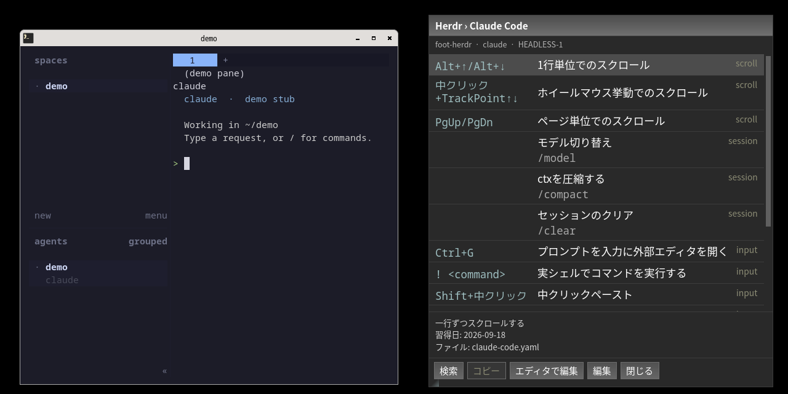

# wayhint

[English](README.md)

Wayland(wlroots 系 compositor: labwc / Wayfire など)で、hotkey 一発で**いま使っているアプリの
チートシート**を画面の決まった場所(既定: 右上)に出す。端末や Herdr の中で動いているコマンド
(vi、Claude Code、Codex …)まで見て中身を切り替える。中身は YAML で自分で書いて育てる。



▶ [60 秒のデモ動画](docs/media/wayhint-demo-60s.en.mp4)(英語の字幕)

- 出している間も keyboard フォーカスを奪わない。元のアプリで作業を続けられる
- 検索・追加・修正・favorite・並べ替えはヒント画面の中でできる
- YAML に書いた command は表示とコピーだけで、実行はしない

開発する人は [`dev-docs/DEVELOPMENT.md`](dev-docs/DEVELOPMENT.ja.md) から。

## やりたいこと → 読むところ

| やりたいこと | 読むところ |
|---|---|
| 入れる | [インストール](#インストール) |
| hotkey を割り当てる、daemon を自動で起動する | [compositor の設定](#compositor-の設定) |
| daemon を止める・再起動する | [daemon の起動と停止](#daemon-の起動と停止) |
| 端末の中のコマンド(vi、Claude Code …)のヒントを出す | [端末の複数ウィンドウ](#端末の複数ウィンドウ)、[`docs/TERMINALS.md`](docs/TERMINALS.ja.md) |
| ヒントを見る・コピーする | [ヒント画面の使い方](#ヒント画面の使い方) |
| ヒントを探す | [検索](#検索) |
| ヒント画面の中でヒントを足す・直す・並べ替える | [編集モード](#編集モード) |
| シートをエディタで書く | [ヒントを書く](#ヒントを書く)、[`docs/SHEET-FORMAT.md`](docs/SHEET-FORMAT.ja.md) |
| コマンドラインからヒントを足す・直す | [CLI でヒントを書き換える](#cli-でヒントを書き換える) |
| 共通のヒントを混ぜる、親子のシートを組む | [どのシートが選ばれるか](#どのシートが選ばれるか)、[`docs/SHEETS.md`](docs/SHEETS.ja.md) |
| 位置・大きさ・言語・エディタ・見た目を変える | [設定ファイル](#設定ファイル)、[`docs/CONFIG.md`](docs/CONFIG.ja.md) |
| hotkey がどの状態で何をするか知る | [`docs/HOTKEYS.md`](docs/HOTKEYS.ja.md) |
| うまく動かない | [困ったとき](#困ったとき) |
| 新しい版にする、やめる | [アップデート](#アップデート)、[アンインストール](#アンインストール) |

## 目次

1. [インストール](#インストール)
2. [compositor の設定](#compositor-の設定)
3. [設定ファイル](#設定ファイル)
4. [ヒント画面の使い方](#ヒント画面の使い方)
5. [ヒントを書く](#ヒントを書く)
6. [端末の複数ウィンドウ](#端末の複数ウィンドウ)
7. [CLI](#cli)
8. [daemon の起動と停止](#daemon-の起動と停止)
9. [アップデート](#アップデート)
10. [アンインストール](#アンインストール)
11. [困ったとき](#困ったとき)

## インストール

依存: Python 3.11+、GTK4 + PyGObject、gtk4-layer-shell(typelib 込み)、
`wlr-foreign-toplevel-management` と `wlr-layer-shell` を出す Wayland compositor(labwc、または
`foreign-toplevel` plugin を有効にした Wayfire)。任意で Herdr と gvim。Debian/sid の場合:

```sh
sudo apt install python3-gi gir1.2-gtk-4.0 libgtk4-layer-shell0 gir1.2-gtk4layershell-1.0
```

```sh
git clone <this repo> ~/work/tools/wayhint && cd ~/work/tools/wayhint
./scripts/setup                 # .venv を作り、Python の依存を入れる
.venv/bin/pip install -e .      # wayhint / wayhintd を .venv/bin に置く
```

端末から `wayhint` と打てるように、PATH の通ったところへリンクを置く(この README の例は `wayhint` を
PATH から呼ぶ前提)。compositor の設定には絶対パスを書くので、そちらはこのリンクに頼らない。

```sh
ln -s ~/work/tools/wayhint/.venv/bin/wayhint ~/work/tools/wayhint/.venv/bin/wayhintd ~/.local/bin/
```

雛形をコピーすれば、そのまま始められる(`style.css` も入る。アプリ既定の配色で使うなら消す)。

```sh
cp -r examples/. ~/.config/wayhint/
```

## compositor の設定

daemon(`wayhintd`)をセッションに 1 つ起動し、hotkey は compositor の keybind から CLI を呼ぶ。
既定の割り当ては次の 3 つ。

| キー | コマンド | 意味 |
|---|---|---|
| `Super+h` | `wayhint toggle` | いま見ているウィンドウのヒントを出す / しまう |
| `Super+Shift+h` | `wayhint search-mode` | 検索に入る / 抜ける |
| `Super+Ctrl+h` | `wayhint edit-mode` | 編集モードに入る / 抜ける |

### labwc(`~/.config/labwc/rc.xml`)

```xml
<keyboard>
  <keybind key="W-h">
    <action name="Execute" command="/home/USER/work/tools/wayhint/.venv/bin/wayhint toggle"/>
  </keybind>
  <keybind key="W-C-h">
    <action name="Execute" command="/home/USER/work/tools/wayhint/.venv/bin/wayhint edit-mode"/>
  </keybind>
  <keybind key="W-S-h">
    <action name="Execute" command="/home/USER/work/tools/wayhint/.venv/bin/wayhint search-mode"/>
  </keybind>
</keyboard>
```

autostart は `~/.config/labwc/autostart` に 1 行足す(ファイルには実行属性を付ける)。反映は
`labwc --reconfigure`。

```sh
/home/USER/work/tools/wayhint/.venv/bin/wayhintd &
```

autostart が起動した helper を終了時に落とす仕組みを使っているなら、その作法に従う
(例: `spawn wayhintd`)。systemd の user unit は用意していない。

### Wayfire(`~/.config/wayfire.ini`)

```ini
[command]
binding_wayhint = <super> KEY_H
command_wayhint = /home/USER/work/tools/wayhint/.venv/bin/wayhint toggle
binding_wayhint_edit = <super> <ctrl> KEY_H
command_wayhint_edit = /home/USER/work/tools/wayhint/.venv/bin/wayhint edit-mode
binding_wayhint_search = <super> <shift> KEY_H
command_wayhint_search = /home/USER/work/tools/wayhint/.venv/bin/wayhint search-mode

[autostart]
wayhint = /home/USER/work/tools/wayhint/.venv/bin/wayhintd
```

`[core] plugins` に `foreign-toplevel` を入れる。無くて `ipc` `ipc-rules` があれば Wayfire IPC に
自動で切り替わる(`config.yaml` の `context.backend: wayland|wayfire` で固定もできる)。

### ほかの compositor

`wlr-foreign-toplevel-management` と `wlr-layer-shell` を出す compositor(sway など)なら動くはずだが、
確かめているのは labwc と Wayfire だけ。hotkey から `wayhint toggle` などを実行し、autostart で
`wayhintd` を起動すればよい。

### 動作確認

`wayhintd -v` を端末で前景起動すると info ログが出る(選ばれた backend は `desktop backend:` の行)。
別の端末から `wayhint ping` で応答を確かめる。IME のための環境変数は要らない(入らないときは
[困ったとき](#困ったとき))。

## 設定ファイル

置き場所は `$XDG_CONFIG_HOME/wayhint/`(既定 `~/.config/wayhint/`)。どれも無くても動く。

| パス | 内容 |
|---|---|
| `config.yaml` | ヒント画面の位置・大きさ、エディタ、言語など。無ければ全部既定値 |
| `style.css` | 任意。GTK CSS で見た目を上書きする。雛形 `examples/style.css` は labwc のテーマ(Syscrash)に合わせた配色 |
| `hints/<言語>/*.yaml` | ヒントのシート。1 ファイル 1 枚([ヒントを書く](#ヒントを書く)) |

- ボタンなどの文字の言語はマシンの locale(`LC_ALL` → `LC_MESSAGES` → `LANG`)で決まる。
  `appearance.language: en|ja` で固定できる。日英以外は英語。
- 検索の絞り込みは設定ではなく状態なので、daemon が `~/.local/state/wayhint/state.yaml` に書く。
  手で書くものではなく、壊れていても daemon は絞り込み無しで起動する。
- 書いたら `wayhint validate` で確かめる(問題があれば exit 1)。保存すれば daemon が自動で読み直す。

`config.yaml` の全項目と既定値、`style.css` の扱いは [`docs/CONFIG.md`](docs/CONFIG.ja.md) にまとめてある。

## ヒント画面の使い方

### 出す・しまう

`Super+h` は「**いま見ているウィンドウのヒント**」を意味する。押すと出し、同じヒントが出ているときにもう一度
押すとしまう。別のウィンドウに移ってから押すと、しまわずにそのウィンドウのヒントに差し替わる。

- 中身は**出した瞬間のウィンドウ**で決まり、別のウィンドウに移っても自動では追従しない。移った先でもう一度
  `Super+h` を押す(マウスだけなら `wayhint refresh`)。
- 出している間はキー入力がヒント画面に届かない。しまうのは hotkey か **閉じる** ボタン。
  `Esc` が効くのは検索中と編集モード中だけ。
- ヒント画面は**出した workspace にだけ**出る。別の workspace に移ると隠れ、戻ると同じ内容で出直す。
  全 workspace に出したいときは `config.yaml` に `context: {workspace: all}`(compositor が
  `ext-workspace-v1` を出す場合だけ効く。labwc は対応、Wayfire は未対応で常に全 workspace)。

3 つの hotkey が状態ごとに何をするか、いつ消えるかは [`docs/HOTKEYS.md`](docs/HOTKEYS.ja.md) に図で
まとめてある。

### 一覧の見方

1 行が 1 ヒントで、左に `key`、中央に title と `command`、右に `category` が出る。行を選ぶと下に
詳細が開き、`remark`、タグ、出典、覚えた日、所属ファイルが出る。

並び順は、`favorite: true` のヒント(`★` 付き)が先頭に YAML に書いた順で並び、その後に残りが
category ごとにまとまる。category の順番は最初に出てきた順、同じ category の中は書いた順。
順番を変えたいときは YAML の中でヒントを並べ替える(編集モードの `J` / `K` でもできる)。

大きさは anchor の反対側(既定の右上なら**左下**)の grip を掴んで変える。角は縦横いっしょに、
左辺・下辺は幅だけ・高さだけ。離したときの大きさが `config.yaml` の `overlay.width` / `height` に
px で書き戻り、次からも同じ大きさで出る。

### ボタン

| ボタン | 動作 |
|---|---|
| 検索 | 検索に入る。もう一度押す(完了)か `Esc` で抜ける。編集モード中は押せない |
| コピー | 選択中のヒントをクリップボードへ。`copy` があればそれ、無ければ `command`。どちらも無いヒントでは押せない |
| エディタで編集 | 選択中のヒントのシートをエディタで開き、その行へ飛ぶ(未選択なら表示中のシート)。ヒント画面は出たままなので、保存するたびに一覧が更新される。検索や編集モードはここで抜ける(keyboard をエディタに渡すため)。編集中の下書きは次に編集モードへ入ると戻る |
| 編集 | 編集モードに入る |
| 閉じる | ヒント画面を閉じる。編集中の下書きは捨てる |

### 検索

`Super+Shift+h`(または検索ボタン)で入る。空白で区切った語を**すべて**含むヒントに絞る。大文字
小文字は区別せず、title、`key`、`command`、`category`、タグ、`remark` が対象。

- 先頭に `#名前` と書くと category で絞る。`Tab` / `Shift+Tab` で category を順に切り替える
  (`#-` は category の無いヒント)。
- 検索欄で `↓` を押すと一覧に移る(打つたびに先頭行が選ばれる)。一覧では次のキーが効き、ヒント画面の
  下にも出る。抜けると keyboard は元のウィンドウに戻る。

  | キー | 動作 |
  |---|---|
  | `↑` `↓` | 選択を動かす。一覧の先頭で `↑` を押すと検索欄に戻る |
  | `c` | 選択中のヒントの `copy`(無ければ `command`)をコピーして検索を抜ける。どちらも無ければコピーせずに抜ける |
  | `Enter` / `Esc` | コピーせずに検索を抜ける(検索欄でも同じ) |
  | `Tab` / `Shift+Tab` | category を切り替える(検索欄) |
- **抜けても絞り込みは残る。** 絞り込みはシートごとに保存され、閉じても daemon を再起動しても
  同じシートを開けば戻る。絞り込み中は一覧の上に chip が出て、`×` で解除する。
- 次に検索に入ると前の絞り込みが全選択で欄に入っている。打てば置き換え、`End` で追記。
- 検索中に `Super+Ctrl+h` を押すと、欄の文字を絞り込みとして残したまま編集モードに移る。

### 編集モード

`Super+Ctrl+h`(または編集ボタン)で入り、同じキーか `Esc` で抜ける。

| キー | 動作 |
|---|---|
| `↑` `↓` | 選択を動かす |
| `a` | ヒントを追加する(追加先は選択中のヒントと同じシート。フォームの見出しに出る) |
| `Enter` | 選択中のヒントを編集する |
| `d` `d` | 選択中のヒントを削除する(1 回目で確認、2 回目で確定) |
| `u` | 直前に削除した 1 件を戻す |
| `f` | favorite を切り替える |
| `J` / `K` | 下 / 上のヒントと入れ替える(同じグループ・同じファイルの中だけ。絞り込み中は効かない) |
| `Esc` | フォームが開いていれば閉じる(入力は捨てる)。開いていなければ編集モードを抜ける |

フォームの中では `Enter` で保存、`Esc` で破棄、`Tab` / `Shift+Tab` で欄を移り、`Ctrl+P` で追加先を
親シートに切り替える。**フォームを保存すると編集モードは終わり**、keyboard が元のアプリに戻る
(1 件書いて作業に戻れるように)。favorite・並べ替え・削除・取り消しは編集モードのまま続けられる。

表示中のシートの YAML が壊れているときは、編集モードに入れない。

## ヒントを書く

ヒントは `~/.config/wayhint/hints/<言語>/` に YAML で書く。1 ファイルが 1 枚のシートで、
**`id` はファイル名(拡張子を除く)と同じにする**。シートに書ける項目の全部と決まりは
[`docs/SHEET-FORMAT.md`](docs/SHEET-FORMAT.ja.md) にまとめてある。

```yaml
# hints/ja/vi.yaml
id: vi
title: vi
match:
  process: {argv_regex: ["^vi$", "^vim$"]}
hints:
  - {id: save, title: 保存, key: ":w", category: ファイル}
  - {id: quit, title: 保存せず終了, key: ":q!", category: ファイル}
  - id: substitute
    title: 全体を置換
    command: ":%s/old/new/g"
    remark: "g を外すと各行の最初の 1 つだけ"
    favorite: true
```

保存すると daemon が自動で読み直す(ヒント画面を閉じる必要はない)。YAML が壊れているときは直前の
正常版を出し続け、ヒント画面の上部に `⚠ YAML error file:line: message` が出る。

### ヒントのフィールド

`id` と `title` だけが必須。

| キー | 用途 |
|---|---|
| `id` | シートの中で一意な名前。ヒント画面には出ない |
| `title` | 一覧に出る説明 |
| `kind` | 種別。`shortcut`(既定)はキー操作、`command` はコマンド、`tip` は両方ある覚え書き、`note` は文章だけの覚え書き。一覧で `key` と `command` を隠すのは `note` だけ。`kind` 自体はヒント画面には出ない |
| `key` | 一覧の左端に出るキー操作。長いものは折り返す(YAML の改行もそのまま出る) |
| `command` | title の下に出るコマンド。**実行はしない**。表示とコピーのみ |
| `category` | 一覧の右端に出る見出し。同じ category は隣り合って並ぶ。書かなければ擬似 category(`inbox` / `未定義`) |
| `tags` | 親シートとして混ざるときの絞り込み([親シートのヒント](#親シートのヒント))。検索の対象にもなる |
| `favorite` | `true` で `★` 付きになり先頭に並ぶ。表示される件数は変わらない |
| `copy` | コピーする文字列が表示と違うときだけ書く。省略時は `command`。`key` はコピーしない |
| `remark` | 選択したときだけ出る補足 |
| `source` | 出典(公式ドキュメントの URL など) |
| `learned` | 覚えた日(ISO 形式の日付) |

### どのシートが選ばれるか

シートは `match` で選ぶ。どれも Python の正規表現で、部分一致。

- `match.wayland.app_id_regex`: ウィンドウの app_id に当てる
- `match.process.argv_regex` / `cmdline_regex`: 端末の中で動いているコマンド(foreground process)に当てる

ウィンドウのシートとコマンドのシートが両方当たれば、ウィンドウのシートが**親**、コマンドのシートが**子**になり、
子のヒントの後ろに親のヒントが並ぶ。端末用のシートは書かなくてよい(その場合はコマンドのシート
だけが出る)。複数のシートが当たったときは `priority`(大きい方)→ 当たった pattern の数 →
ファイル名順で 1 枚に決まる。`match` の無いシートは単独では出ず、`include` で混ぜるためだけに使える。

コマンドを答えるのは、Herdr なら Herdr 自身(**ウィンドウの app_id に `herdr` が含まれていること**)、
foot などの端末なら wayhint が `/proc` を辿って調べる。端末のウィンドウが 2 つ以上あるときは
[端末の複数ウィンドウ](#端末の複数ウィンドウ)の起動規約が要る。

規則の全体は [`docs/SHEETS.md`](docs/SHEETS.ja.md) に図でまとめてある。

### 親シートのヒント

**何も書かなければ、親のヒントは全部子の一覧に並ぶ。** 絞りたいときは親のシートに
`nested.export_tags`(タグで)か `nested.export_categories`(category で)を書く。両方書くと、
どちらかに当たるヒントが渡る。

```yaml
# hints/ja/herdr.yaml — terminal タグの付いたヒントだけを子の一覧に渡す
id: herdr
title: Herdr
match: {wayland: {app_id_regex: [herdr]}}
nested: {export_tags: [terminal]}
hints:
  - {id: new-pane, title: 新しいペイン, key: Ctrl+Shift+N, tags: [terminal]}
  - {id: theme, title: テーマを切り替える, key: Ctrl+Shift+T}   # 子の一覧には出ない
```

- category で渡すなら `nested: {export_categories: [基本]}` のように書く(ヒントに印を付けなくてよい)。
- 子のシートに `inherit.parent_tags` / `parent_categories` を書くと、その子だけ別の絞りにできる。
- 親のヒントをどこにも混ぜたくないときは、`config.yaml` に `nested: {parent_tags: []}` と書く。
- `[]` はどこに書いても、もう片方に関係なく「親のヒントを出さない」。

### 他のシートを混ぜる(`include`)

WM の操作や IME のような共通のヒントを 1 枚にまとめ、各シートに混ぜられる。

```yaml
# hints/ja/wm.yaml — match が無いので単独では出ない。混ぜるためだけのシート
id: wm
title: ウィンドウマネージャ
hints:
  - {id: close-window, title: ウィンドウを閉じる, key: Super+Shift+Q}
```

```yaml
# hints/ja/claude-code.yaml(match とヒントは省略)
id: claude-code
title: Claude Code
include:
  - wm                                # このシートの一覧の末尾に wm のヒントが並ぶ
  - {sheet: git, categories: [基本]}   # git からは「基本」category のヒントだけ
```

```yaml
# config.yaml — include を書いていないシート全部に効く既定
include: [wm]
```

- シートの `include:` は config の既定を**置き換える**(足し算ではない)。`include: []` で何も混ぜない。
- id だけ書くと全部混ざる。一部だけにしたいときは `{sheet, tags, categories}` の形で書く。
  タグと category を両方書くと、どちらかに当たるヒント。`[]` は 0 件。
- 混ぜた先の `include` は辿らない(1 段だけ)。
- 無い id を書いてもシートは出る。ヒント画面の ⚠ と `wayhint validate` に警告が出る(exit 0)。
- 混ざったヒントを編集・削除すると、**そのヒントのファイル**が書き換わる(詳細欄の `ファイル:`)。

### 言語ごとのヒント

シートは言語ごとのディレクトリに置き、**表示に使う言語のディレクトリだけ**が読まれる。

```
~/.config/wayhint/hints/
  ja/   claude-code.yaml  herdr.yaml   # 日本語環境ではこちらだけ
  en/   claude-code.yaml  herdr.yaml
```

- 言語はボタンの文字と同じ決め方なので、ヒントと UI の言語がずれない。
- 探す順は `hints/<言語>/` → `hints/en/` → `hints/*.yaml`。1 言語だけならフラットのままでよい。
- 同じ id のシートを言語ごとに置ける。翻訳の同期は自動では行わない。
- 切り替えは `appearance.language` を書き換えるだけ(再起動は要らない)。

### エディタ

`config.yaml` の `editor.command` は argv の list。placeholder は `{file}` `{line}` `{hint_id}`。
shell を通らないので、引用符やパイプは書けない。

```yaml
editor:
  command: [code, --goto, "{file}:{line}"]
```

`wayhint schema --write` でヒント シートの JSON Schema を書き出し(既定 `~/.config/wayhint/schema.json`)、
シートの先頭に次の行を置くと、yaml-language-server で key の補完と検証が効く。
`editor.schema_modeline: true` にすると、新しく作るシートと `wayhint format` がこの行を自動で付ける。

```yaml
# yaml-language-server: $schema=/home/USER/.config/wayhint/schema.json
```

## 端末の複数ウィンドウ

端末のウィンドウが 2 つ以上あると、wayhint は**どのウィンドウが前面か**を知る必要がある。Wayland にも labwc にも
「このウィンドウを描いているのはどのプロセスか」を答える手段が無いので、**ウィンドウの側が app_id で名乗る**
規約にしている。app_id の末尾が `.p<pid>` なら、その数字を端末の PID として使う。

```sh
#!/bin/sh
# ~/.local/bin/foot-wayhint
exec /usr/bin/foot --app-id "foot.p$$" "$@"
```

この wrapper を作り、**端末を起動する経路すべて**(compositor の keybind、bar、メニュー、`.desktop`)を
そこへ向ける。接尾辞は wayhint が外してから照合するので、シートの `app_id_regex` は `["^foot$"]` のままでよい。

- 対応: foot / kitty / Ghostty / Alacritty(それぞれ条件あり)と Herdr(ウィンドウの app_id に `herdr` を含めて起動する。
  例 `foot --app-id=foot-herdr`)。WezTerm はウィンドウごとに app_id を変えられないので対象外。
- wrapper を通さないウィンドウでも、その端末のプロセスが 1 つだけなら解決する。

設定は script でできる。**`--apply` を付けない限り何も書かない**。bar や compositor の設定は
書き換えず、変える行を表示するだけ。

```sh
./scripts/setup-terminals           # dry run。何をするか表示するだけ
./scripts/setup-terminals --apply   # wrapper / .desktop / launcher 設定まで直す
```

端末ごとの条件と、効いているかの確かめ方は [`docs/TERMINALS.md`](docs/TERMINALS.ja.md)。

## CLI

`wayhint <command>` は daemon に 1 行送るだけで、画面は持たない。

| コマンド | 動作 |
|---|---|
| `toggle` | 出す / しまう(`Super+h`) |
| `search-mode` | 検索に入る / 抜ける(`Super+Shift+h`)。編集モード中は断る |
| `edit-mode` | 編集モードに入る / 抜ける(`Super+Ctrl+h`) |
| `show` | 出す |
| `hide` | しまう。検索中・編集中は `toggle` と同じく、モードと下書きを残して隠すだけ |
| `refresh` | 出ているなら、いまのウィンドウで中身を取り直す |
| `reload` | `config.yaml` とヒントを読み直す |
| `ping` | daemon の生死確認。pid とシート数を返す |
| `validate` | YAML を検証する。daemon が無くても動く。問題があれば exit 1 |
| `context` | いまのウィンドウでどのシートが選ばれるかを表示する。`--shown` を付けると、表示中のヒント画面の中身と、混ざったヒントをどう絞ったかを出す |
| `inspect SHEET [--parent ID]` | シートの include と、仮定した親のヒントが、何件中何件混ざるかを出す。daemon が無くても動く |
| `add` / `edit` / `remove` / `favorite` / `move` | ヒントを書き換える(下) |
| `format [PATH...]` | シートを決まった順・形に整える |
| `schema [--write PATH]` | ヒントシートの JSON Schema を出す |

`validate` は `--config-dir`、それ以外は `--socket` で既定の場所を変えられる。各コマンドの引数は
`wayhint <command> --help` で出る。

### CLI でヒントを書き換える

`add` `edit` `remove` `favorite` `move` は、`--sheet` で**書き込むシートの id を必ず指定する**。daemon を
通さず自分でシートのファイルに書くので、daemon が止まっていても使える。保存すればヒント画面にもすぐ
反映される。

```
wayhint add TITLE --sheet ID [--kind K] [--key S | --command S] [--category S] [--remark S]
wayhint edit ID --sheet ID [--title S] [--kind K] [--key S | --command S] [--category S] [--remark S]
wayhint remove ID --sheet ID
wayhint favorite ID --sheet ID [--off]
wayhint move ID up|down --sheet ID
wayhint format [--modeline] [PATH...]        # PATH を省くと使用中の hints/<言語>/*.yaml 全部
```

例:

```sh
wayhint add "保存して終了" --key ":wq" --category ファイル --sheet vi
wayhint add "設定を開く" --kind command --command "vim ~/.vimrc" --sheet vi
wayhint edit save --key ":w!" --sheet vi       # ID はヒントの id(一覧には出ないのでシートを見る)
wayhint favorite save --sheet vi
wayhint move save up --sheet vi
wayhint remove save --sheet vi
```

- シートの id はファイル名(拡張子を除く)と同じ。親シートに足すときも `--sheet herdr` のように親の id を書く。
- CLI ではシートを新しく作れない。新しいシートはエディタで書くか、編集モードの `a` で作る。
- `add` の `id` はタイトルから自動で作られる(英数字にできないタイトル、たとえば日本語だけのものは
  `q-<日時>`)。作られた id は `added <id> to <file>` と出力されるので、`edit` などにはそれを使う。
  `learned` には今日の日付が入る。
- `--kind` に合わない欄は指定できない。`shortcut`(既定)は `--key` だけ、`command` は `--command`
  だけ、`tip` は両方、`note` はどちらも不可。
- `move` は同じグループ(favorite どうし、または同じ category)の隣とだけ入れ替える。越える場合はエラー。
- `tags` `copy` `source` は CLI でも編集モードのフォームでも書けない。エディタでシートに書く。

### `wayhint context` の読み方

「なぜこのシートが出たのか」を確かめるためのもの。値のある項目だけを `key=value` で並べる。
foot で vi を動かしているときはこうなる(実際は 1 行):

```
$ wayhint context
active_sheet=vi desktop_app=foot.p12345 chain=['ProcAdapter'] \
  process={'name': 'vi', 'argv_basenames': ['vi', 'notes.txt']}
```

- `chain` が空: 端末とみなされていない(コマンドを調べていない)。
- `chain` はあるが `process` が無い: 調べたが決められなかった(規約に乗っていないウィンドウが複数ある、など)。
  間違ったシートを出すより出さない。
- `desktop_app` の `.p12345` はウィンドウの識別用で、シートの照合や表示には使われない。

端末の中で `wayhint context` を打つと、`wayhint` 自身が前面のコマンドになってしまう。端末の中を
確かめるときは `wayhint context --shown` を使う(下)。

### 混ざるはずのヒントが出ないとき

親シートや `include` から混ざるヒントは、タグや category の絞りで落ちることがある。どこで落ちたかは
次の 2 つで確かめる。

- **シートを書いているとき**: `wayhint inspect <シートの id>`。include の要素ごとに、絞りの中身と
  「何件中何件混ざるか」を出す。親はそのシートが動くウィンドウで決まるので、`--parent herdr` のように
  仮定して渡すと、親のヒントの絞りも出る。
- **実際の画面で**: 見たいウィンドウで `Super+h` を押してヒント画面を出し、別の端末から
  `wayhint context --shown`。表示中の中身(調べ直さない)について、選ばれたシート・親・絞りと、
  その絞りがどこ(どのファイルのどの key)から来たかを出す。

```
$ wayhint inspect claude-code --parent herdr
sheet claude-code (claude-code.yaml)
parent herdr: 4/12 shown
  tags: pane -- nested.export_tags (herdr.yaml)
  categories: not narrowed
include git: 3/9 shown (from claude-code.yaml)
  tags: not narrowed
  categories: 基本
```

`0/12` のように 0 件なら、タグや category の書き間違いを疑う。件数は重複を除く前の数。

## daemon の起動と停止

- **起動**: ふつうは compositor の autostart が、ログインと同時に起動する([compositor の設定](#compositor-の設定))。
  手で起動するなら `~/work/tools/wayhint/.venv/bin/wayhintd &`。すでに動いていれば
  `wayhintd already running` と出て終わる。
- **停止**: compositor を終了すると一緒に止まる。手で止めるなら `kill "$(wayhint ping | sed -n 's/^pid=\([0-9]*\).*/\1/p')"`
  (daemon は socket を片付けてから終わる)。
- **落ちたとき**: 自動では起動し直さない。hotkey を押しても何も出ず、`wayhint ping` が
  `wayhintd is not running` を返す。下の再起動の 1 行で起動し直す。
- **ログ**: 前景で見たいときは `wayhintd -v` を端末で動かす。

### 再起動する

ヒント・`config.yaml` の変更は自動で反映されるので、再起動が要るのは wayhint を更新したときと、
`style.css` を変えたときだけ。次の 1 行で止めて起動し直す:

```sh
cd ~/work/tools/wayhint && p=$(.venv/bin/wayhint ping | sed -n 's/^pid=\([0-9]*\).*/\1/p'); \
  [ -n "$p" ] && kill "$p" && while kill -0 "$p" 2>/dev/null; do sleep 0.1; done; \
  nohup .venv/bin/wayhintd -v >>"${XDG_RUNTIME_DIR:-/tmp}/wayhint.log" 2>&1 & disown
```

- pid は `wayhint ping` から取る。`pkill -f wayhintd` は**この行を実行しているシェル自身にも当たる**
  ので使わない。
- daemon が動いていなければ `wayhint: wayhintd is not running …` が出るが、そのまま起動する。
- 前の daemon が socket を片付けるのを待ってから起動する(待たないと `wayhintd already running` で終わる)。
- ログは `$XDG_RUNTIME_DIR/wayhint.log` に追記され、ログアウトで消える。

## アップデート

```sh
cd ~/work/tools/wayhint
git pull
./scripts/setup                 # Python の依存が変わっていれば入れ直す
.venv/bin/pip install -e .
```

そのあと daemon を[再起動する](#再起動する)。`~/.config/wayhint/` の設定とシートには触らない。
新しい版で設定やシートの書式が変わっていれば、`wayhint validate` が教える。

## アンインストール

順に戻す。どれも wayhint が自動では行わない。

1. daemon を止める([daemon の起動と停止](#daemon-の起動と停止))。
2. compositor の設定から、hotkey の 3 行と autostart の行を消す(labwc は `labwc --reconfigure`)。
3. 端末の設定を戻す(`./scripts/setup-terminals --apply` を使っていた場合):
   - `~/.local/bin/<端末>-wayhint` の wrapper を消す
   - `~/.local/share/applications/<端末>.desktop` を消す(システムの `.desktop` に戻る)
   - 書き換えられた bar や compositor の設定は、同じディレクトリの
     `<ファイル名>.wayhint-backup-<日時>` から戻す(または行の wrapper を元のコマンドに戻す)
4. 設定と状態を消す: `~/.config/wayhint/`(シートも含む。残すならバックアップを取る)と
   `~/.local/state/wayhint/`。
5. `~/.local/bin/` に置いた `wayhint` と `wayhintd` のリンクを消し、repository(`~/work/tools/wayhint/`)を消す。

## 困ったとき

| 症状 | 確認すること |
|---|---|
| `wayhint: wayhintd is not running` | `wayhintd -v` を前景で起動してログを見る。socket は `$XDG_RUNTIME_DIR/wayhint.sock` |
| `⚠ compositor does not provide wlr-foreign-toplevel-management` | labwc なら出ない。Wayfire は `[core] plugins` に `foreign-toplevel`、または `ipc` を入れて IPC に任せる |
| `⚠ Wayfire IPC unavailable` | `context.backend: wayfire` 固定時のみ。`echo $WAYFIRE_SOCKET`、`[core] plugins` に `ipc` |
| `this Wayland session has no layer-shell support` | `gir1.2-gtk4layershell-1.0` が入っているか。X11 / Xwayland では動かない |
| ヒントが足りない / 消えた | 絞り込みが残っていないか、一覧の上の chip を見る。解除は chip の `×`。絞り込みはシートごとに保存されるので、別のシートを開くと効いていないように見える |
| 親シートや include のヒントが混ざらない | [混ざるはずのヒントが出ないとき](#混ざるはずのヒントが出ないとき)。`wayhint inspect` か `wayhint context --shown` で、どの絞りで落ちたかを見る |
| 「エディタで編集」でエディタが開かない | `config.yaml` の `editor.command` の先頭のコマンドが PATH にあるか。端末の中で動くエディタ(vim など)は端末ごと起動する形で書く(`[foot, -e, nvim, "+{line}", "{file}"]`)。`wayhintd -v` のログに理由が出る |
| hotkey を押しても何も出ない | `wayhint ping` で daemon が動いているか。止まっていれば[再起動する](#再起動する) |
| 端末の中のコマンドのシートが出ない | `wayhint context` の `chain` と `process` を見る(上の「読み方」)。ウィンドウが複数なら[端末の複数ウィンドウ](#端末の複数ウィンドウ)の規約に乗っているか |
| Herdr の中で親シートしか出ない | `herdr pane process-info --pane <focus 中の pane id>` の `foreground_processes` と `argv_regex` を照合する |
| Herdr でタブを切り替えてもヒントが変わらない | `herdr pane current` の `focused` と `pane_id` を確認する |
| 検索欄や編集フォームで日本語(IME)が入らない | GTK が Wayland ネイティブの入力(text-input-v3)を選べていない。`gsettings get org.gnome.desktop.interface gtk-im-module` が空でなければ `gsettings reset org.gnome.desktop.interface gtk-im-module`。`GTK_IM_MODULE` も未設定にする。確かめるには `GTK_IM_MODULE= WAYLAND_DEBUG=1 wayhintd` の出力に `zwp_text_input_v3.enter` と `enable` が出るか |
| 検索後にキー入力が元のアプリに戻らない | 同じ app_id のウィンドウが複数あり title も変わっていると、戻り先を決められない。`wayhintd -v` に `could not return focus` が出るか |
