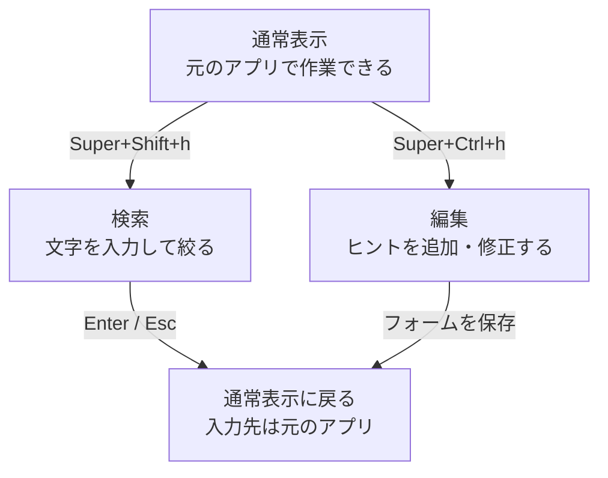
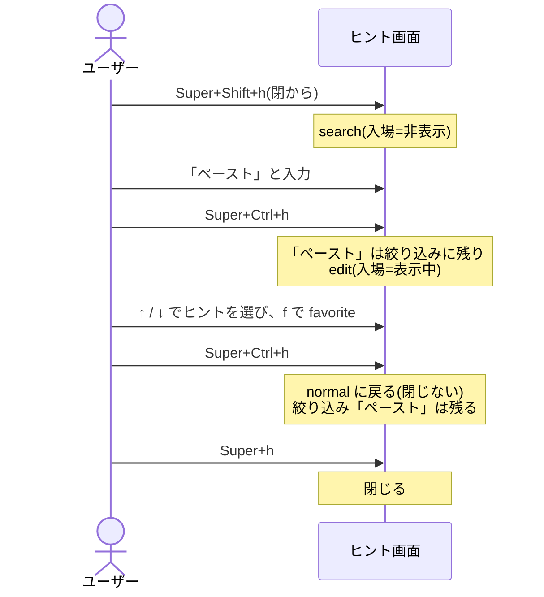

# HOTKEYS — 3 つの hotkey とヒント画面の出入り
[English](HOTKEYS.md)

ヒントを見るときは `Super+h`、探すときは `Super+Shift+h`、書き換えるときは `Super+Ctrl+h`。
このページでは、表示・検索・編集の切り替えと、ヒント画面を閉じる場合／一時的に隠す場合の違いを説明する。
`Super` は通常、Windows ロゴの付いたキー。

| キー(labwc / Wayfire の割り当て) | コマンド | 意味 |
|---|---|---|
| `Super+h` | `wayhint toggle` | いま見ているウィンドウのヒントを出す / しまう |
| `Super+Shift+h` | `wayhint search-mode` | 検索に入る / 抜ける |
| `Super+Ctrl+h` | `wayhint edit-mode` | 編集モードに入る / 抜ける |

この割り当てを使うには、[README の設定手順](../README.ja.md#compositor-の設定)に従って登録する。
表のコマンドは端末からも実行できる。

## 1. 状態

ヒント画面には、見るだけの「通常」、文字を入力する「検索」、ヒントを書き換える「編集」がある。
以下の表では、それぞれ `normal`、`search`、`edit` と表記する。

| 状態 | 表示 | キー入力の送り先 | 残るもの |
|---|---|---|---|
| 閉 | 無し | 元のアプリ | シートごとに保存した絞り込み。表示内容は次回選び直す |
| 通常(normal) | あり | 元のアプリ | 表示中のシート、絞り込み |
| 検索(search) | あり | ヒント画面 | 上に加えて検索欄の入力 |
| 編集(edit) | あり | ヒント画面 | 表示中のシート、絞り込み、フォームの下書き |
| 隠れ(normal / search / edit) | 無し | 元のアプリ | シートと絞り込み、編集の下書き。検索の扱いは下記 |

「隠れ」は一時的に表示を外した状態。検索・編集中の `Super+h` は入力を残して隠す。
通常表示中の `Super+h` は、同じウィンドウなら閉じる。
ワークスペースを離れたときも隠れるが、この場合は検索を終えて絞り込みを保存する。
戻ると通常表示になり、編集中だった場合は下書きごと戻る(詳しくは §4)。

検索・編集の hotkey をもう一度押してモードを抜けると、**そのモードに入る前の表示状態**へ戻る。
非表示から入ったなら閉じ、表示中から入ったなら通常表示になる。
編集フォームが開いているときは、最初の1回でフォームを閉じ、次の1回で編集モードを抜ける。

## 2. 状態遷移

まずは、表示中のヒントを検索・編集して、元の作業に戻る流れ。

- 検索は `Enter` / `Esc` で終える。**絞り込みは残り、コピーはしない**。
  コピーする場合は、検索欄から `↓` で一覧へ移り、ヒントを選んで `c` を押す。
- 編集を保存せず終える場合は `Esc`。フォームが開いていれば、まずフォームを閉じる。
- 非表示から検索・編集へ直接入る場合、同じ hotkey をもう一度押す場合、検索から編集へ移る場合は §3。
  一時的に隠す場合やワークスペースを移る場合は §4。

## 3. 状態 × キーの一覧

「context」は、いま使っているウィンドウと、その中で動いているコマンドの情報。
「取り直す」は、キーを押した時点でこの情報を調べ直すこと。フォーカスが別のウィンドウ(Herdr の別タブなど)に
移っていれば、そのウィンドウのヒントに差し替えてからモードに入る(0033 A / 0035)。

### `Super+h`(toggle)

| 状態 | 結果 |
|---|---|
| 閉 | context を取って normal で出す |
| normal、同じウィンドウ | 閉じる |
| normal、別のウィンドウ | そのウィンドウのヒントに差し替える(閉じない。0013) |
| 隠れ normal | そのまま出し直す |
| search / edit | 隠す。モード・検索欄・下書きはそのまま、keyboard は放す |
| 隠れ search / edit | 差し替えずにそのまま出し直す。keyboard も取り直す |

search / edit 中の `Super+h` が差し替えではなく隠す / 出すなのは、書きかけのものを別のウィンドウのヒントで
消さないため(0014 D4)。

### `Super+Shift+h`(search-mode)

| 状態 | 結果 |
|---|---|
| 閉 / 隠れ normal | context を取って出し、search に入る(入場=非表示) |
| normal | 取り直してから search に入る(入場=表示中) |
| search | 抜ける。入場=非表示なら閉じる、表示中なら normal に戻る |
| 隠れ search | そのまま出し直す(search のまま) |
| edit | **拒否**。表示されていれば「編集を終えてから検索してください」を出す |

### `Super+Ctrl+h`(edit-mode)

| 状態 | 結果 |
|---|---|
| 閉 / 隠れ normal | context を取って出し、edit に入る(入場=非表示) |
| normal | 取り直してから edit に入る(入場=表示中)。エディタ起動で持ち越した下書きがある view は差し替えない(0023) |
| search | 欄の文字を絞り込みとして残して search を抜け、取り直して edit に入る(入場=表示中。0033 C) |
| 隠れ search | context を取り直して出す(search は抜けて絞り込みを保存)、edit に入る(入場=非表示) |
| edit、フォームが開いている | フォームを閉じるだけ(`Esc` と同じ)。次の 1 打で抜ける |
| edit、フォームが無い | 抜ける。入場=非表示なら閉じる、表示中なら normal に戻る |
| 隠れ edit | そのまま出し直す(下書きも) |
| 表示中のシートの YAML が壊れている | **拒否**して理由を出す。keyboard は取らない |

## 4. いつ消えるか

**閉じる**(次に出すと context から取り直す):

- normal で、同じウィンドウから `Super+h`。normal での `wayhint hide`。
- toolbar の「閉じる」ボタン。search の絞り込みは保存する。edit の下書きは捨てる。
- 非表示から入ったモードで、そのモードの hotkey をもう一度押して抜ける。編集フォームが開いている
  ときは、先にフォームを閉じるため、もう1回必要。

**隠れる**(次に出すと同じ状態で戻る):

- search / edit 中の `Super+h` と `wayhint hide`。keyboard だけ放し、モードは残す(0037)。
- workspace を離れる(0012)。戻ると自動で出し直す。search はこの時点で抜けて絞り込みを保存するので、
  戻ったときは normal になっている。edit は下書きごと残る。

ワークスペース自体を削除した場合は、そのワークスペースの表示状態と下書きも破棄する。

**消えない**:

- search の `Esc` / `Enter` / `c`(`c` はコピーしてから)、フォームの保存。モードを抜けて normal の表示に戻る
  だけで、フォーカスは元のウィンドウへ返す(0021 / 0033 / 0039)。
- 「エディタで編集」。search / edit を抜けて keyboard を放すが、ヒント画面は残る(0023)。edit の下書きは
  次の `Super+Ctrl+h` で戻る。
- 別のウィンドウにフォーカスを移すこと。context は hotkey を押したときにだけ取る(idle polling はしない)ので、
  ヒント画面は前のウィンドウのヒントのまま残る。次に `Super+h` を押すとそのウィンドウのヒントに差し替わる。
- normal では keyboard を取らないので、`Esc` などのキーはそもそもヒント画面に届かない。

## 5. 組み合わせの例

search に非表示から入っていても、そこから edit に移ると「入場=表示中」になる。edit に入った時点では
ヒント画面が表示されていたからである。そのため、edit を 2 度目で抜けても閉じずに normal へ戻る。
