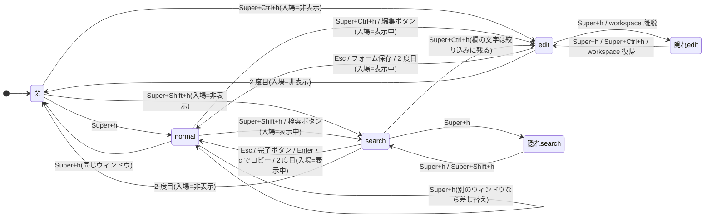
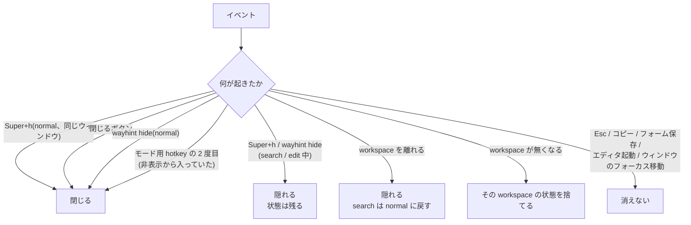
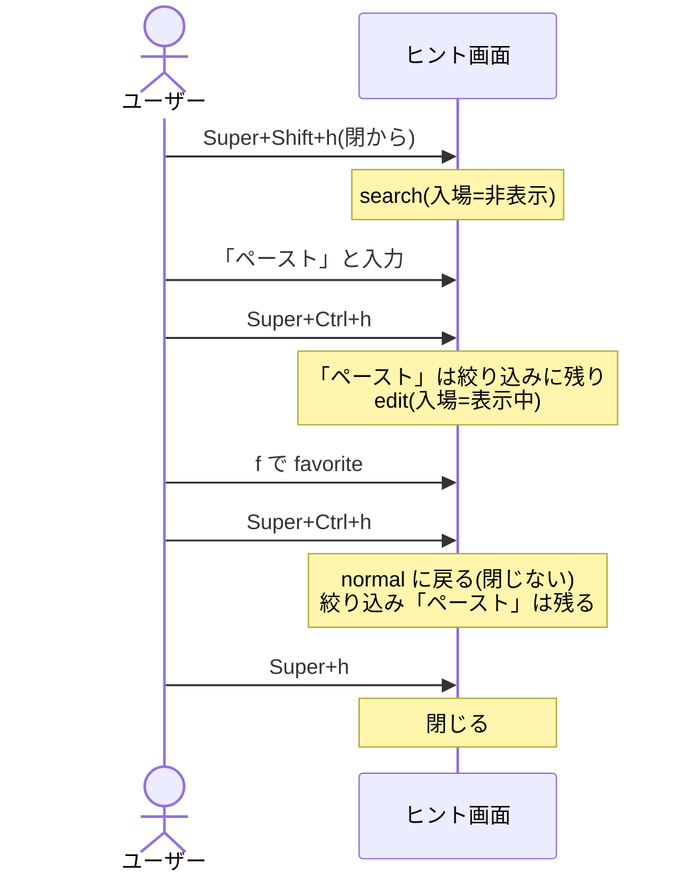

# HOTKEYS — 3 つの hotkey とヒント画面の出入り

wayhint の hotkey は compositor の keybind から CLI を呼ぶ形で届く(DECISIONS 0004)。この文書は
3 つの hotkey が状態ごとに何をするか、ヒント画面がいつ消えるかを 1 か所にまとめる。仕様の本文は
`dev-docs/DESIGN.md`「編集モード」§1〜§2、経緯は DECISIONS 0012 / 0013 / 0014 D4 / 0023 / 0033 / 0035 / 0037。

| キー(labwc / Wayfire の割り当て) | コマンド | 意味 |
|---|---|---|
| `Super+h` | `wayhint toggle` | いま見ているウィンドウのヒントを出す / しまう |
| `Super+Shift+h` | `wayhint search-mode` | 検索に入る / 抜ける |
| `Super+Ctrl+h` | `wayhint edit-mode` | 編集モードに入る / 抜ける |

割り当ては compositor 側で設定する(README「compositor の設定」)。

## 1. 状態

ヒント画面の状態は workspace ごとに持つ(0012)。1 つの workspace について、次のどれかになる。

| 状態 | 表示 | keyboard | 持っているもの |
|---|---|---|---|
| 閉 | 無し | 取らない | 何も無い |
| normal | 表示 | 取らない(NONE) | context、絞り込み |
| search | 表示 | 取る(EXCLUSIVE) | 上に加えて検索欄 |
| edit | 表示 | 取る(EXCLUSIVE) | 上に加えてフォームの下書き |
| 隠れ(normal / search / edit) | 無し | 取らない | 表示中と同じものを保持 |

「隠れ」は閉じたのではなく、表示を外しただけの状態。`Super+h`(か `wayhint hide`)を押す、または workspace を
離れるとこの状態になる。もう一度出すと元の状態で戻る。

各モードは「**入ったときにヒント画面が表示されていたか**」を覚えている(0014 D4 amend)。
モード用 hotkey を 2 度目に押すと、その状態へ戻る。

## 2. 状態遷移

図に入れていない経路:

- どの状態からでも、toolbar の「閉じる」で**閉**になる。search は抜けて絞り込みを保存する。edit の
  下書きは捨てる。
- `wayhint hide` は `Super+h` で隠すときと同じ(0037)。search / edit 中なら隠れ search / 隠れ edit に、
  normal なら閉になる。
- workspace を離れると、表示されていたものは隠れる(§4)。
- edit 中の `Super+Shift+h` は拒否する(下の表)。

## 3. 状態 × キーの一覧

「取り直す」は、押した時点の context を解決し直すこと。フォーカスが別のウィンドウ(Herdr の別タブなど)に
移っていれば、そのウィンドウのヒントに差し替えてからモードに入る(0033 A / 0035)。

### `Super+h`(toggle)

| 状態 | 結果 |
|---|---|
| 閉 | context を取って normal で出す |
| normal、同じウィンドウ | 閉じる |
| normal、別のウィンドウ | そのウィンドウのヒントに差し替える(閉じない。0013) |
| 隠れ normal | そのまま出し直す |
| search / edit | 隠す。モード・検索欄・下書きはそのまま、keyboard は放す |
| 隠れ search / edit | 差し替えずにそのまま出し直す。keyboard も取り直す |

search / edit 中の `Super+h` が差し替えではなく隠す / 出すなのは、書きかけのものを別のウィンドウのヒントで
消さないため(0014 D4)。

### `Super+Shift+h`(search-mode)

| 状態 | 結果 |
|---|---|
| 閉 / 隠れ normal | context を取って出し、search に入る(入場=非表示) |
| normal | 取り直してから search に入る(入場=表示中) |
| search | 抜ける。入場=非表示なら閉じる、表示中なら normal に戻る |
| 隠れ search | そのまま出し直す(search のまま) |
| edit | **拒否**。表示されていれば「編集を終えてから検索してください」を出す |

### `Super+Ctrl+h`(edit-mode)

| 状態 | 結果 |
|---|---|
| 閉 / 隠れ normal | context を取って出し、edit に入る(入場=非表示) |
| normal | 取り直してから edit に入る(入場=表示中)。エディタ起動で持ち越した下書きがある view は差し替えない(0023) |
| search | 欄の文字を絞り込みとして残して search を抜け、取り直して edit に入る(入場=表示中。0033 C) |
| 隠れ search | context を取り直して出す(search は抜けて絞り込みを保存)、edit に入る(入場=非表示) |
| edit、フォームが開いている | フォームを閉じるだけ(`Esc` と同じ)。次の 1 打で抜ける |
| edit、フォームが無い | 抜ける。入場=非表示なら閉じる、表示中なら normal に戻る |
| 隠れ edit | そのまま出し直す(下書きも) |
| 表示中のシートの YAML が壊れている | **拒否**して理由を出す。keyboard は取らない |

## 4. いつ消えるか

**閉じる**(次に出すと context から取り直す):

- normal で、同じウィンドウから `Super+h`。normal での `wayhint hide`。
- toolbar の「閉じる」ボタン。search の絞り込みは保存する。edit の下書きは捨てる。
- 非表示から入ったモードで、そのモードの hotkey をもう一度押す(0014 D4 amend)。

**隠れる**(次に出すと同じ状態で戻る):

- search / edit 中の `Super+h` と `wayhint hide`。keyboard だけ放し、モードは残す(0037)。
- workspace を離れる(0012)。戻ると自動で出し直す。search はこの時点で抜けて絞り込みを保存するので、
  戻ったときは normal になっている。edit は下書きごと残る。

**消えない**:

- `Esc`、`Enter` / `c` でのコピー、フォームの保存。モードを抜けて normal の表示に戻るだけで、フォーカスは元の
  ウィンドウへ返す(0021 / 0033)。
- 「エディタで編集」。search / edit を抜けて keyboard を放すが、ヒント画面は残る(0023)。edit の下書きは
  次の `Super+Ctrl+h` で戻る。
- 別のウィンドウにフォーカスを移すこと。context は hotkey を押したときにだけ取る(idle polling はしない)ので、
  ヒント画面は前のウィンドウのヒントのまま残る。次に `Super+h` を押すとそのウィンドウのヒントに差し替わる。
- normal では keyboard を取らないので、`Esc` などのキーはそもそもヒント画面に届かない。

## 5. 組み合わせの例

search に非表示から入っていても、そこから edit に移ると「入場=表示中」になる。edit に入った時点では
ヒント画面が表示されていたからである。そのため、edit を 2 度目で抜けても閉じずに normal へ戻る。
