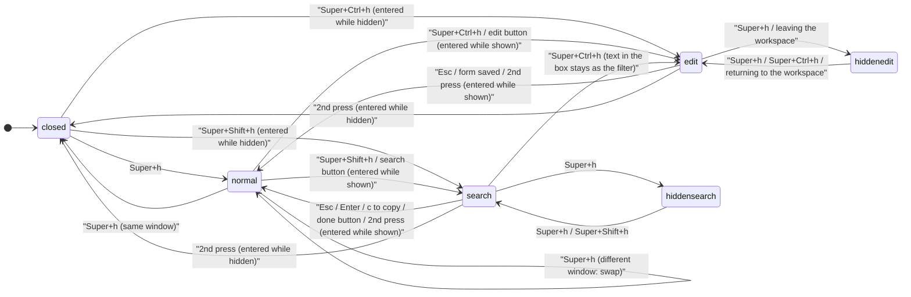
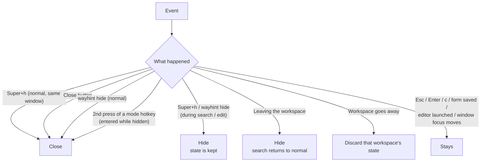
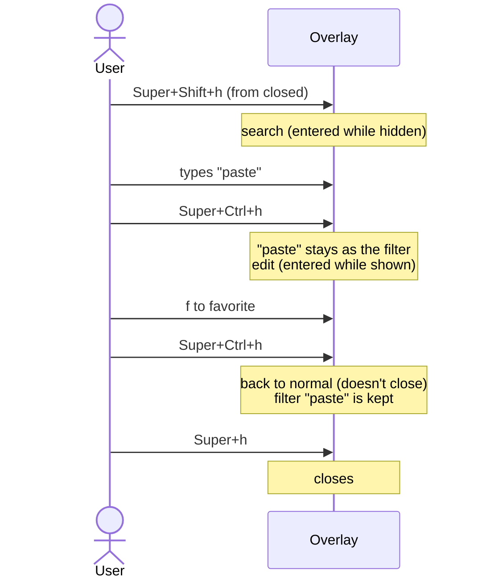

# HOTKEYS — the 3 hotkeys and the overlay's comings and goings
[日本語](HOTKEYS.ja.md)

wayhint's hotkeys arrive by having the compositor's keybind call the CLI (DECISIONS 0004). This
page brings together, in one place, what the 3 hotkeys do in each state and when the overlay goes
away. The spec itself is in `dev-docs/DESIGN.ja.md`, "Edit mode" §1–§2; the history is in
DECISIONS 0012 / 0013 / 0014 D4 / 0023 / 0033 / 0035 / 0037.

| Key (as bound in labwc / Wayfire) | Command | Meaning |
|---|---|---|
| `Super+h` | `wayhint toggle` | show / put away the hints for the window currently in focus |
| `Super+Shift+h` | `wayhint search-mode` | enter / leave search |
| `Super+Ctrl+h` | `wayhint edit-mode` | enter / leave edit mode |

The binding is set up on the compositor side (README, "Setting up the compositor").

## 1. States

The overlay's state is kept per workspace (0012). For a given workspace, it is always one of the
following.

| State | Shown | Keyboard | Holds |
|---|---|---|---|
| closed | none | not taken | nothing |
| normal | shown | not taken (NONE) | context, filter |
| search | shown | taken (EXCLUSIVE) | the above plus the search box |
| edit | shown | taken (EXCLUSIVE) | the above plus the form's draft |
| hidden (normal / search / edit) | none | not taken | keeps whatever was shown |

"Hidden" is not closed, just not shown for the moment. Pressing `Super+h` (or `wayhint hide`), or
leaving the workspace, moves into this state. Showing it again returns to the same state it was
in.

Each mode remembers "**was the overlay shown when this mode was entered**" (0014 D4 amend).
Pressing the mode's hotkey a second time returns to that state.

## 2. State transitions

Routes not shown in the diagram:

- From any state, the toolbar's "close" button goes to **closed**. It leaves search, saving the
  filter. It discards edit's draft.
- `wayhint hide` behaves the same as hiding with `Super+h` (0037). During search / edit it goes to
  hidden search / hidden edit; from normal it goes to closed.
- Leaving the workspace hides whatever was shown (§4).
- `Super+Shift+h` during edit is refused (see the table below).

## 3. State × key table

"Re-resolve" means resolving the context again at the moment the key is pressed. If focus has
moved to a different window (e.g. a different Herdr tab), it swaps to that window's hints before
entering the mode (0033 A / 0035).

### `Super+h` (toggle)

| State | Result |
|---|---|
| closed | resolve context and show it in normal |
| normal, same window | close |
| normal, different window | swap to that window's hints (doesn't close, 0013) |
| hidden normal | just show it again |
| search / edit | hide. Mode, search box and draft are kept, keyboard is released |
| hidden search / edit | show it again without swapping, keyboard is retaken too |

The reason `Super+h` during search / edit hides / shows instead of swapping is so that work in
progress isn't wiped out by another window's hints (0014 D4).

### `Super+Shift+h` (search-mode)

| State | Result |
|---|---|
| closed / hidden normal | resolve context, show it, and enter search (entered while hidden) |
| normal | re-resolve, then enter search (entered while shown) |
| search | leave. If entered while hidden, close; if entered while shown, return to normal |
| hidden search | just show it again (stays in search) |
| edit | **refused**. If shown, displays "finish editing before searching" |

### `Super+Ctrl+h` (edit-mode)

| State | Result |
|---|---|
| closed / hidden normal | resolve context, show it, and enter edit (entered while hidden) |
| normal | re-resolve, then enter edit (entered while shown). A view that carried a draft over from launching the editor is not swapped out (0023) |
| search | leave search, keeping the box's text as the filter, re-resolve, and enter edit (entered while shown, 0033 C) |
| hidden search | re-resolve and show (leaves search, saving the filter), enter edit (entered while hidden) |
| edit, a form is open | just close the form (same as `Esc`). The next press leaves edit |
| edit, no form open | leave. If entered while hidden, close; if entered while shown, return to normal |
| hidden edit | just show it again (draft included) |
| the shown sheet's YAML is broken | **refused** with the reason shown. Keyboard is not taken |

## 4. When it goes away

**Closes** (re-resolves from context on the next show):

- `Super+h` from normal, from the same window. `wayhint hide` from normal.
- The toolbar's "close" button. Search's filter is saved; edit's draft is discarded.
- Pressing a mode's hotkey again, for a mode entered while hidden (0014 D4 amend).

**Hides** (returns to the same state on the next show):

- `Super+h` and `wayhint hide` during search / edit. Only the keyboard is released; the mode is
  kept (0037).
- Leaving the workspace (0012). Coming back shows it again automatically. Search leaves at this
  point, saving the filter, so it's back in normal when you return. Edit is kept, draft included.

**Stays**:

- Search's `Esc` / `Enter` / `c` (`c` copies first), the form being saved. This just leaves the
  mode back to the normal view, returning focus to the original window (0021 / 0033 / 0039).
- "Edit in editor". Leaves search / edit and releases the keyboard, but the overlay stays (0023).
  Edit's draft comes back on the next `Super+Ctrl+h`.
- Moving focus to a different window. Context is only resolved when a hotkey is pressed (no idle
  polling), so the overlay stays showing the previous window's hints. The next `Super+h` swaps it
  to that window's hints.
- Normal doesn't take the keyboard, so keys like `Esc` never reach the overlay in the first place.

## 5. A combined example

Even having entered search while hidden, moving from there into edit makes it "entered while
shown", because the overlay was shown at the moment edit was entered. That's why leaving edit on
the second press doesn't close it, but returns to normal instead.
