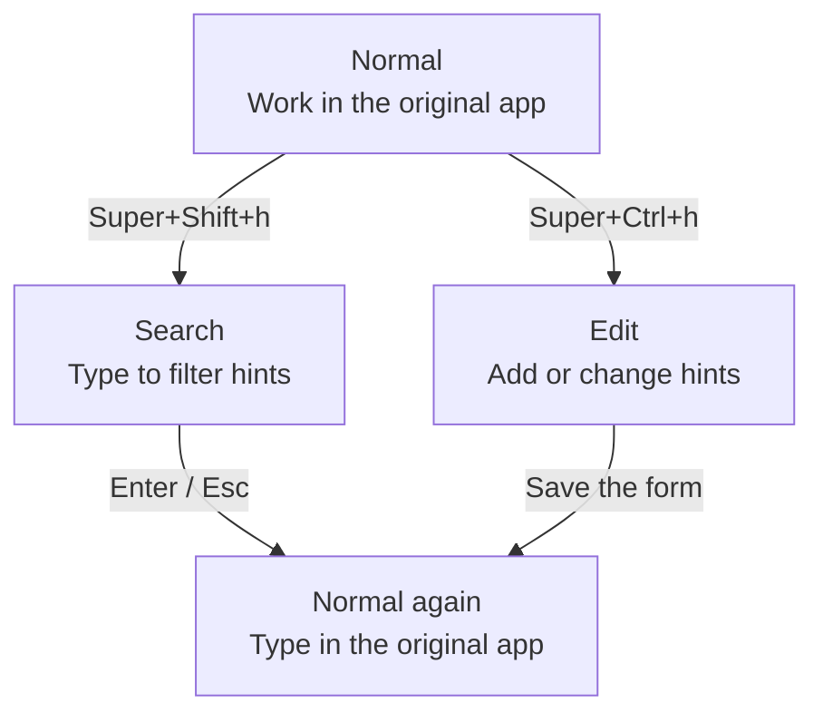
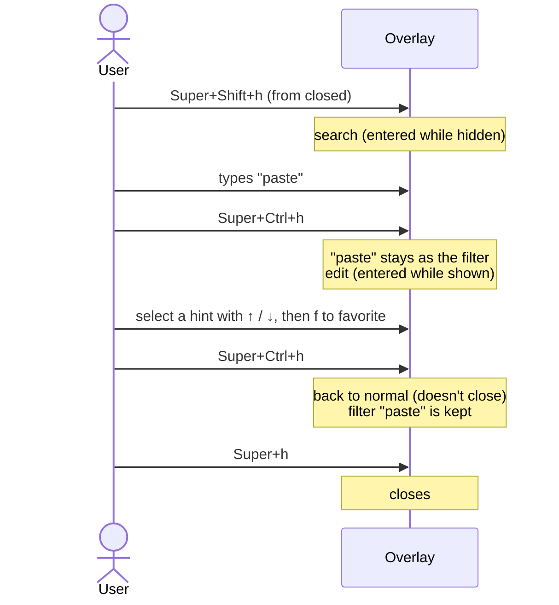

# HOTKEYS — the 3 hotkeys and the overlay's comings and goings
[日本語](HOTKEYS.ja.md)

Use `Super+h` to view hints, `Super+Shift+h` to search, and `Super+Ctrl+h` to edit.
This page explains how to switch between those modes and what changes when you close the
overlay or temporarily hide it. `Super` is usually the key with the Windows logo.

| Key (as bound in labwc / Wayfire) | Command | Meaning |
|---|---|---|
| `Super+h` | `wayhint toggle` | show / put away the hints for the window currently in focus |
| `Super+Shift+h` | `wayhint search-mode` | enter / leave search |
| `Super+Ctrl+h` | `wayhint edit-mode` | enter / leave edit mode |

Register these bindings using the [README setup instructions](../README.md#compositor-setup).
You can also run the commands in the table from a terminal.

## 1. States

The overlay has three modes: **normal** for viewing hints, **search** for typing a filter,
and **edit** for changing hints. The tables below use those names.

| State | Shown | Keys go to | What is kept |
|---|---|---|---|
| closed | no | original app | Saved filters for each sheet; the displayed content is chosen again next time |
| normal | yes | original app | Displayed sheet and filter |
| search | yes | overlay | The above plus text in the search box |
| edit | yes | overlay | Displayed sheet, filter and form draft |
| hidden (normal / search / edit) | no | original app | Sheet, filter and edit draft; see below for search |

"Hidden" means temporarily out of view. During search or edit, `Super+h` hides the overlay
and keeps your input. In normal mode, the same key closes it when pressed from the same window.
Leaving the workspace also hides it, but ends search and saves the filter: returning shows
normal mode. An edit draft returns in edit mode instead (see §4).

Leaving search or edit by pressing its hotkey again restores **the visibility from before you
entered that mode**: it closes if you entered while hidden, or returns to normal if already shown.
If an edit form is open, the first press closes the form; the next press leaves edit mode.

## 2. State transitions

Start with the common path: search or edit hints that are already shown, then return to work.

```mermaid
flowchart TD
    N["Normal<br/>Work in the original app"]
    N -- "Super+Shift+h" --> S["Search<br/>Type to filter hints"]
    N -- "Super+Ctrl+h" --> E["Edit<br/>Add or change hints"]
    S -- "Enter / Esc" --> R["Normal again<br/>Type in the original app"]
    E -- "Save the form" --> R
```

- `Enter` / `Esc` ends search. **The filter stays; nothing is copied.** To copy, press `↓`
  from the search box to enter the list, select a hint, then press `c`.
- To leave edit without saving, press `Esc`. If a form is open, this closes the form first.
- For entering directly from hidden, pressing a mode's hotkey again, or switching from search
  to edit, see §3. For temporarily hiding the overlay or changing workspace, see §4.

## 3. State × key table

"Context" means the current window and the command running inside it. "Re-resolve" means
checking that information again at the moment the key is pressed. If focus has
moved to a different window (e.g. a different Herdr tab), it swaps to that window's hints before
entering the mode (0033 A / 0035).

### `Super+h` (toggle)

| State | Result |
|---|---|
| closed | resolve context and show it in normal |
| normal, same window | close |
| normal, different window | swap to that window's hints (doesn't close, 0013) |
| hidden normal | just show it again |
| search / edit | hide. Mode, search box and draft are kept, keyboard is released |
| hidden search / edit | show it again without swapping, keyboard is retaken too |

The reason `Super+h` during search / edit hides / shows instead of swapping is so that work in
progress isn't wiped out by another window's hints (0014 D4).

### `Super+Shift+h` (search-mode)

| State | Result |
|---|---|
| closed / hidden normal | resolve context, show it, and enter search (entered while hidden) |
| normal | re-resolve, then enter search (entered while shown) |
| search | leave. If entered while hidden, close; if entered while shown, return to normal |
| hidden search | just show it again (stays in search) |
| edit | **refused**. If shown, displays "finish editing before searching" |

### `Super+Ctrl+h` (edit-mode)

| State | Result |
|---|---|
| closed / hidden normal | resolve context, show it, and enter edit (entered while hidden) |
| normal | re-resolve, then enter edit (entered while shown). A view that carried a draft over from launching the editor is not swapped out (0023) |
| search | leave search, keeping the box's text as the filter, re-resolve, and enter edit (entered while shown, 0033 C) |
| hidden search | re-resolve and show (leaves search, saving the filter), enter edit (entered while hidden) |
| edit, a form is open | just close the form (same as `Esc`). The next press leaves edit |
| edit, no form open | leave. If entered while hidden, close; if entered while shown, return to normal |
| hidden edit | just show it again (draft included) |
| the shown sheet's YAML is broken | **refused** with the reason shown. Keyboard is not taken |

## 4. When it goes away

**Closes** (re-resolves from context on the next show):

- `Super+h` from normal, from the same window. `wayhint hide` from normal.
- The toolbar's "close" button. Search's filter is saved; edit's draft is discarded.
- Leaving a mode with its hotkey, after entering while hidden. If an edit form is open, close
  it first with one press; another press leaves the mode.

**Hides** (returns to the same state on the next show):

- `Super+h` and `wayhint hide` during search / edit. Only the keyboard is released; the mode is
  kept (0037).
- Leaving the workspace (0012). Coming back shows it again automatically. Search leaves at this
  point, saving the filter, so it's back in normal when you return. Edit is kept, draft included.

Deleting the workspace itself discards its displayed state and any draft.

**Stays**:

- Search's `Esc` / `Enter` / `c` (`c` copies first), the form being saved. This just leaves the
  mode back to the normal view, returning focus to the original window (0021 / 0033 / 0039).
- "Edit in editor". Leaves search / edit and releases the keyboard, but the overlay stays (0023).
  Edit's draft comes back on the next `Super+Ctrl+h`.
- Moving focus to a different window. Context is only resolved when a hotkey is pressed (no idle
  polling), so the overlay stays showing the previous window's hints. The next `Super+h` swaps it
  to that window's hints.
- Normal doesn't take the keyboard, so keys like `Esc` never reach the overlay in the first place.

## 5. A combined example

```mermaid
sequenceDiagram
    actor U as User
    participant O as Overlay
    U->>O: Super+Shift+h (from closed)
    Note over O: search (entered while hidden)
    U->>O: types "paste"
    U->>O: Super+Ctrl+h
    Note over O: "paste" stays as the filter<br/>edit (entered while shown)
    U->>O: select a hint with ↑ / ↓, then f to favorite
    U->>O: Super+Ctrl+h
    Note over O: back to normal (doesn't close)<br/>filter "paste" is kept
    U->>O: Super+h
    Note over O: closes
```

Even having entered search while hidden, moving from there into edit makes it "entered while
shown", because the overlay was shown at the moment edit was entered. That's why leaving edit on
the second press doesn't close it, but returns to normal instead.
