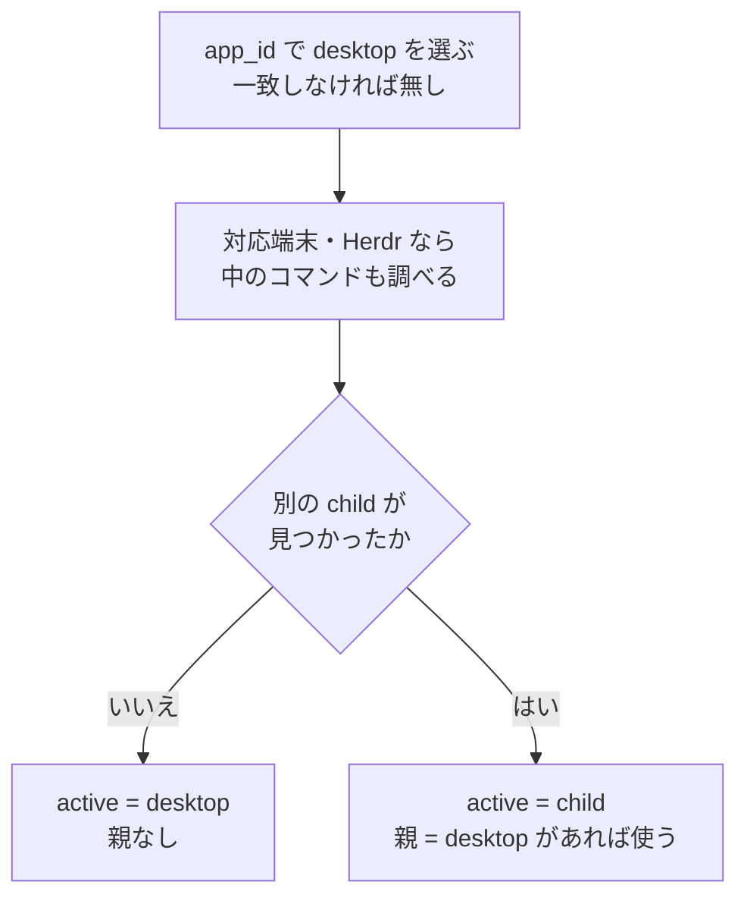
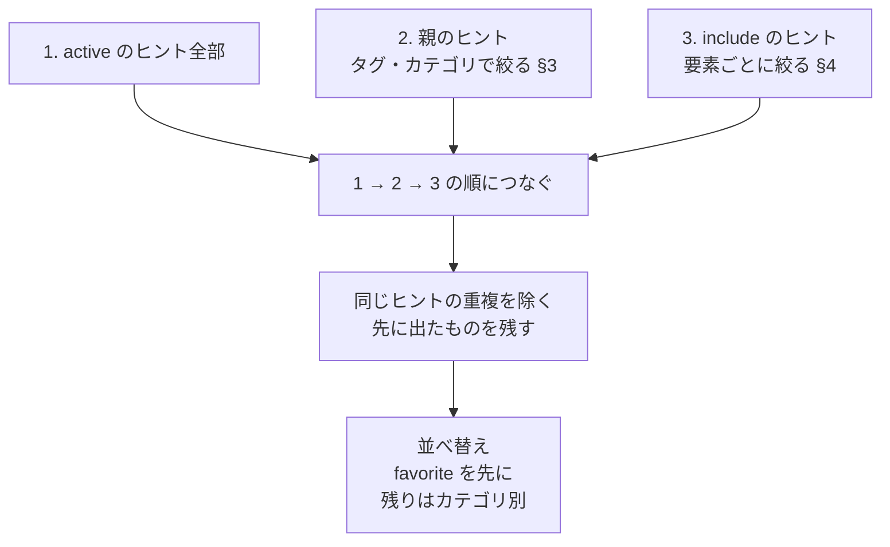

# SHEETS — シートの選ばれ方と、他シートのヒントの混ざり方

[English](SHEETS.md)

ヒント画面の一覧は 1 枚のシートだけでできているとは限らない。親シート(nested)と `include` の
2 経路で他のシートのヒントが混ざる。

例えば Herdr の中で Claude Code を使う場合、Claude Code のヒントを主に表示し、Herdr のペイン操作を
親シートから足せる。さらに `include` で、共通の Git 操作などを足せる。
まず §1 で主役のシートを選び、§2 で一覧を組み立てる。絞り方の詳細は §3〜§4、
YAML の書式は [シートの書き方](SHEET-FORMAT.ja.md)を参照。

用語:

- **desktop シート**: ウィンドウに合うシート(例: Herdr)。ウィンドウの識別名 `app_id` を照合する。
- **child シート**: 端末や Herdr の中で操作中のコマンドに合うシート(例: Claude Code)。
- **active シート**: 表示の主役。child があれば child、無ければ desktop。
- **親シート**: child が選ばれたときの desktop シート。

## 1. active シートと親シートの決まり方



- 図の結果が active なしなら、表示するシートは無い。共通の `include` も混ざらない。
- 複数のシートが当たったら priority(大きい順) → 一致した正規表現の数(多い順) → ファイル名順で 1 枚に
  決める(DECISIONS 0007)。
- nested provider を呼ぶかどうかは **app_id だけ**で決める。desktop シートの有無は関係ない
  (DECISIONS 0027)。そのため foot のように端末自身のシートが無くても、中の `vi` のシートは選ばれる。
  ただしこの場合は親が無いので、親ヒントは混ざらない。
- nested は 1 段だけ(`foot → tmux → herdr → claude` のような多段は辿らない。0027)。
- `match` の無いシートは active にならない。`include` から読み込まれたときだけ一覧に出る。

## 2. 一覧の組み立て



1. **連結**: active → 親(絞った分)→ include(記述順)の順につなぐ。
2. **重複の除去**: 同じヒントが 2 つの経路から来たら `(ファイル, id)` で 1 件にする(0019)。
   同じシートが親でもあり include 先でもある場合も、ここで 1 回にまとまる。
3. **並べ替え**(0014 D7):
   - favorite 区画: category を無視し、連結した順(= YAML の記述順)。
   - 非 favorite 区画: 非 favorite のヒントだけで数えた category の初出順。同じ category の中は記述順。
     `category: null` は 1 グループとして初出の位置に入る。
   - category の順番を決める設定は無い。変えるときは YAML の中でヒントの順番を入れ替える。

どこから来たヒントかは一覧に出さない(無印。0026)。詳細欄には所属ファイル名が出る。

## 3. 親ヒントの絞り(nested)

child が選ばれ、親シートがあるときだけ働く(0034、0039)。絞りは**タグ**と **category** の 2 本で、
それぞれ同じ規則で「どこに書いてあるものを使うか」を決める。

**① どの設定を使うか。** 次の表を上から見て、最初に書いてある値だけを使う。
タグとカテゴリは別々に選ぶので、タグは子、カテゴリは親から採る場合もある。
省略・`null` は次の段へ進み、`[]` は空の指定としてその段で決定する。

| 段 | 書く場所 | 用途 |
|---|---|---|
| 1 | 子シートの `inherit.parent_tags` / `parent_categories` | この子だけ例外にする(全体で止めていてもこの子には渡す、など) |
| 2 | config.yaml の `nested.parent_tags` / `parent_categories` | `[]` で親ヒントを既定で止める。段1の子ごとの指定があればそちらを使う |
| 3 | 親シートの `nested.export_tags` / `export_categories` | **通常はここで絞る**。何を子に渡すかを親自身が決める |
| 4 | (どこにも書かない) | 絞らない |

**② 選ばれた設定でヒントを絞る。** 複数の段の条件を重ねるのではなく、①で選んだタグとカテゴリだけを使う。

| 選ばれたタグ・カテゴリ | 表示する親ヒント |
|---|---|
| どちらかが `[]` | 0件。もう片方の条件では復活しない |
| 両方とも未指定 | 全部 |
| タグだけ指定 | 指定したタグのどれかを持つヒント |
| カテゴリだけ指定 | 指定したカテゴリのどれかに一致するヒント |
| 両方とも空でないリスト | タグ **または** カテゴリが一致するヒント(OR) |

カテゴリは完全一致。カテゴリ未設定のヒントは、どのカテゴリ指定にも当たらない。

段 2 で絞る(空でない list を書く)ことは推奨しない。段 2 は段 3 より上にあるので、書いた時点で
全部の親の `export_*` が無視され、「Herdr だけ別の絞り」ができなくなる。段 2 が段 3 より上にある
のは、子ごとの例外を除き、`[]` で親ヒントをまとめて止められるようにするためである。

`export_*` は nested の親経路にだけ効く。同じシートが `include` で混ざるときは見ない(§4)。

```yaml
# hints/ja/herdr.yaml(親、抜粋)— pane タグか「基本」category のヒントだけを子に渡す
nested:
  export_tags: [pane]
  export_categories: [基本]
```

## 4. include

シートの `include:` に並べたシートのヒントを、そのシートの一覧に混ぜる(0026、0039)。要素は
シートの id(全部混ぜる)か、`{sheet, tags, categories}`(一部だけ混ぜる)。

1. active シートに `include` があれば使う。省略・`null` なら `config.yaml` の `include` を使う。
2. 各要素を記述順に読む。idだけなら全ヒント、`tags` / `categories` があれば §3 の②と同じ規則で絞る。
3. include 先の `include` は辿らず、選んだヒントを §2 の一覧に足す。

```yaml
include:
  - wm                                   # 全部
  - {sheet: git, categories: [基本]}      # 「基本」category だけ
  - sheet: shell
    tags: [daily]                        # daily タグか「移動」category のヒント
    categories: [移動]
```

- シート側の `include` は config の既定を**置き換える**(足し算ではない)。
- 絞り込みは要素ごと。同じシートを 2 回、別の絞りで書いてもよい(重なったヒントは §2 で 1 件になる)。
- 解決できない id と、シートが自分自身を指す id は warning で、その id だけ無視する(シートは表示される)。
  config の既定は全シートに掛かるので、既定由来の自己参照は黙って外す。
- active シートが無い context では include も混ざらない(config の既定も)。

## 5. 経路の比較

| | 親シート(nested) | include |
|---|---|---|
| 何で決まるか | ウィンドウの app_id(desktop シート) | active シートの `include`、無ければ config |
| 絞り | §3 の 4 段で決まる tag / category | 要素ごとの `tags` / `categories` |
| 一覧の位置 | active の次 | 最後 |
| 多段 | しない(1 段) | しない(include 先の include は辿らない) |
| quick add の `Ctrl+P` | 追加先を親に切り替えられる | 無い |

## 6. どう絞られたかを確かめる

- `wayhint inspect <シート id> [--parent <id>]` — ファイルだけから計算する。include の要素ごとの絞りと件数、
  `--parent` を付ければ、その親のもとでの §3 の tag / category と、それぞれがどの段から来たか。
- `wayhint context --shown` — 表示中のヒント画面について同じことを出す(調べ直さないので、端末の中で
  打ってもよい)。親は実際のウィンドウで決まったもの。

## 7. 混ざったヒントを編集するとき

- 編集・削除・favorite は、そのヒントの**所属ファイル**に書く(0019、0014 D9)。
  親や include 先のヒントを直すと、そのシートのファイルが書き換わる。
- `J` / `K` の並べ替えはファイルを跨がない(0014 D8)。隣が別シートのヒントなら動かない。
- quick add の追加先は**選択中のヒントのシート**。未選択なら active シート(0025)。前面のアプリの
  シートが無いか空のときは、選択に関係なく前面のアプリのシートに入る(無ければ保存時に作る。0041)。`Ctrl+P` で親
  シートに切り替えると、§3 で tag の絞りが決まっている場合に限り、その tag を自動で付ける
  (category の絞りに合わせた値は付けない。合わない category で足すと子の一覧には出ない。0034、0039)。
