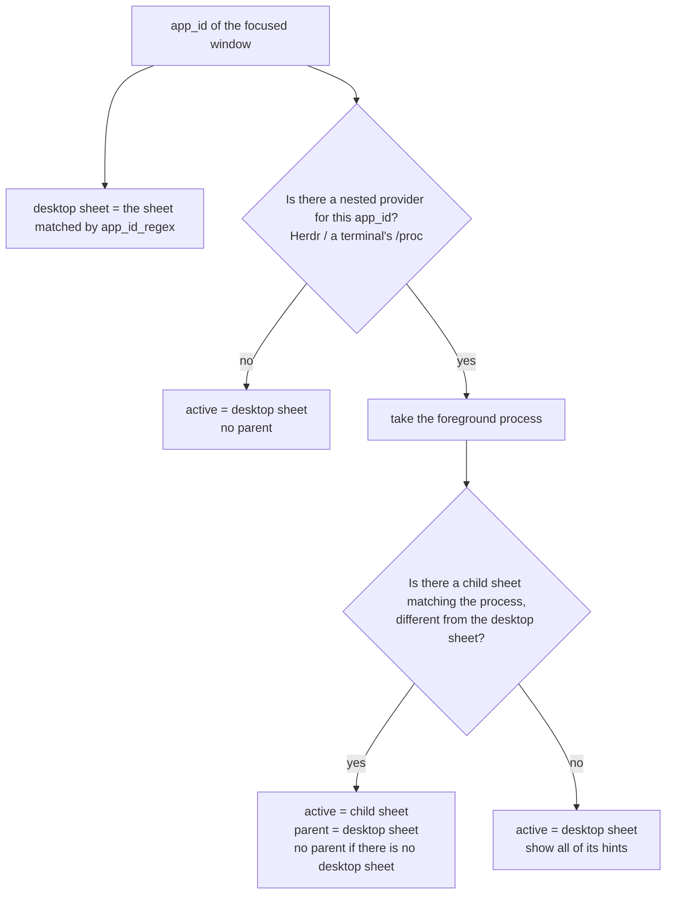
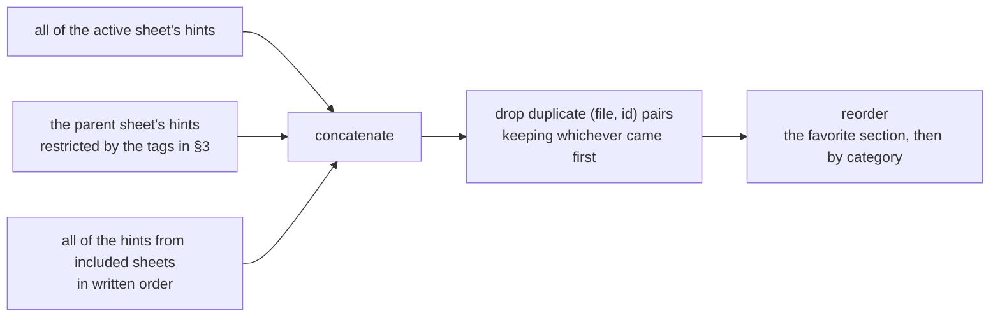
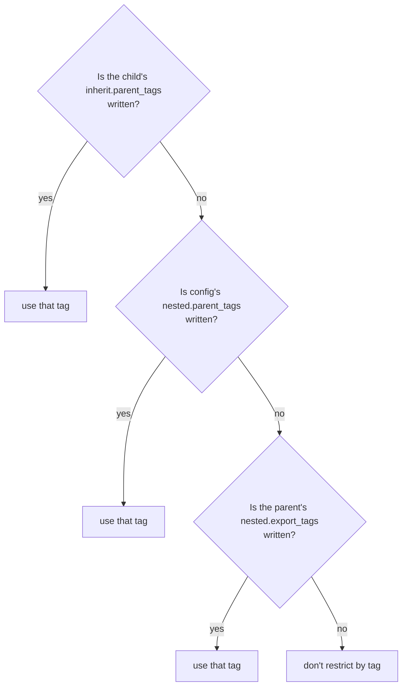
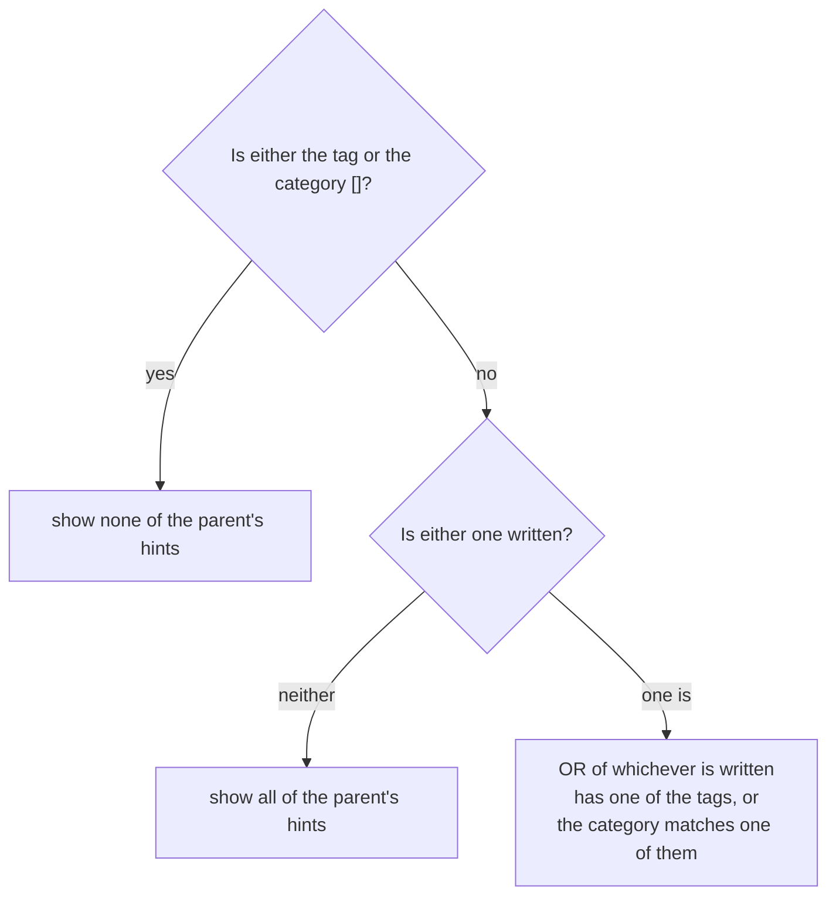
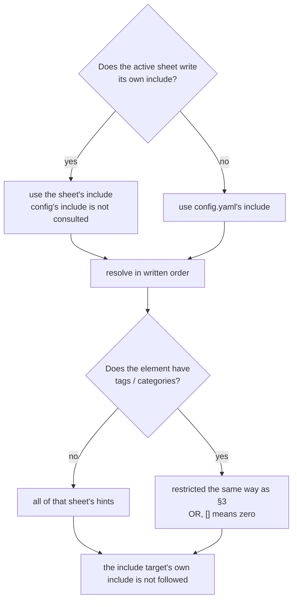

# SHEETS — how sheets are chosen, and how other sheets' hints mix in

[日本語](SHEETS.ja.md)

The overlay's list is not necessarily made up of a single sheet. Other sheets' hints mix in
through two routes: the parent sheet (nested) and `include`. This document collects those rules
in one place. The shape of each YAML key is authoritative in `dev-docs/DESIGN.md`, "Data model";
the reasoning behind each decision is authoritative in the entries of `dev-docs/DECISIONS.md`.

Terms:

- **desktop sheet**: the sheet matched by `match.wayland.app_id_regex` against the app_id of the
  focused window.
- **child sheet**: the sheet matched by `match.process.*` against the foreground process inside a
  terminal or Herdr.
- **active sheet**: the sheet that plays the lead role for that context. The child if there is
  one, otherwise the desktop sheet.
- **parent sheet**: the desktop sheet, when a child has been chosen.

## 1. How the active sheet and the parent sheet are decided



- When several sheets match, one is decided by priority → specificity (the number of regexes
  matched) → filename order (DECISIONS 0007).
- Whether the nested provider is called is decided by **app_id alone**; whether a desktop sheet
  exists is irrelevant (DECISIONS 0027). That is why the sheet for `vi` inside foot is chosen even
  when foot itself has no sheet — but in that case there is no parent, so no parent hints mix in.
- Nesting goes only one level (a chain like `foot → tmux → herdr → claude` is not followed. 0027).
- A sheet with no `match` never becomes active. It appears in the list only when loaded through
  `include`.

## 2. Assembling the list



1. **Concatenate**: connect active → parent (restricted) → include (in written order).
2. **Remove duplicates**: if the same hint arrives by two routes, it is reduced to one by
   `(file, id)` (0019). If the same sheet is both a parent and an included sheet, it is also
   merged here into one occurrence.
3. **Reorder** (0014 D7):
   - The favorite section: ignores category, in concatenated order (= the order written in the
     YAML).
   - The non-favorite section: category order is the order categories first appear, counting only
     non-favorite hints. Within the same category, written order. `category: null` forms one
     group, placed at the position it first appears.
   - There is no setting for deciding category order. To change it, swap the order of hints in
     the YAML.

Which route a hint came from is not shown in the list (unmarked. 0026). The detail pane shows the
name of the file it belongs to.

## 3. Restricting parent hints (nested)

This only takes effect when a child has been chosen and there is a parent sheet (0034, 0039). The
restriction has two independent axes, **tag** and **category**, each deciding "where to look" by
the same rule.



Category works the same way, checked in the order `inherit.parent_categories` →
`nested.parent_categories` → `nested.export_categories`. Tag and category are decided
independently (it can happen that tag comes from the child while category comes from the parent).

- **Only the first level found is used**; levels below it are never consulted. The intersection of
  multiple levels is never taken.
- "Written" means the key exists. `null` counts as not written.

With the tag and category decided this way, the parent's hints are chosen as follows.



- If both tag and category are written, it is an **OR**: a hint matching either is shown.
- `[]` always means **zero**, no matter what is written on the other side. `config.yaml`'s
  `nested.parent_tags: []` can be used to stop any parent's hints from mixing into a child (even
  if the parent has `export_categories`, it cannot break through this).
- Category is an exact match. A hint with no category never matches any category restriction.

The role of each level (shared between tag and category):

| level | where it is written | purpose |
|---|---|---|
| 1 | the child sheet's `inherit.parent_tags` / `parent_categories` | Makes an exception for this one child (e.g. still pass hints to it even though everything is stopped globally) |
| 2 | `config.yaml`'s `nested.parent_tags` / `parent_categories` | **For a global opt-out (`[]`)**. Stops any parent's hints from mixing into any child |
| 3 | the parent sheet's `nested.export_tags` / `export_categories` | **Normally, restrict it here.** The parent itself decides what it hands to children |
| 4 | (written nowhere) | no restriction |

Restricting at level 2 (writing a non-empty list) is not recommended. Because level 2 sits above
level 3, writing it there causes every parent's `export_*` to be ignored, making it impossible to
give Herdr its own separate restriction. Level 2 sits above level 3 so that `[]` can reliably stop
everything.

`export_*` only affects the nested parent route. It is not consulted when the same sheet is mixed
in via `include` (§4).

```yaml
# hints/en/herdr.yaml (parent, excerpt) — pass only pane-tagged hints or the "basics" category to the child
nested:
  export_tags: [pane]
  export_categories: [basics]
```

## 4. include

The hints of the sheets listed in a sheet's `include:` are mixed into that sheet's list (0026,
0039). An element is either a sheet id (mixes in all of it) or `{sheet, tags, categories}` (mixes
in only part of it).



```yaml
include:
  - wm                                   # all of it
  - {sheet: git, categories: [basics]}      # only the "basics" category
  - sheet: shell
    tags: [daily]                        # hints tagged daily or in the "movement" category
    categories: [movement]
```

- A sheet's own `include` **replaces** config's default (it does not add to it).
- Restriction is per element. The same sheet can be written twice with different restrictions
  (overlapping hints are merged into one in §2).
- An id that cannot be resolved, or a sheet referring to itself, is a warning; only that id is
  ignored (the sheet is still shown). Because config's default applies to every sheet, a
  self-reference coming from that default is silently dropped.
- With no active sheet, nothing is mixed in through include either (nor through config's
  default).

## 5. Comparing the two routes

| | parent sheet (nested) | include |
|---|---|---|
| decided by | the window's app_id (desktop sheet) | the active sheet's `include`, falling back to config |
| restriction | the tag / category decided by §3's four levels | per-element `tags` / `categories` |
| position in the list | right after active | last |
| multiple levels | no (one level) | no (the include target's own include is not followed) |
| quick add's `Ctrl+P` | can switch the destination to the parent | not available |

## 6. Checking how something was restricted

- `wayhint inspect <sheet id> [--parent <id>]` — computed from the files alone. Shows each
  include element's restriction and count; with `--parent`, also the tag / category decided under
  §3 for that parent, and which level each came from.
- `wayhint context --shown` — shows the same for the overlay currently displayed (it does not
  recompute, so it can be run from inside a terminal too). The parent is whichever was decided by
  the actual window.

## 7. Editing a mixed-in hint

- Editing, deleting, and favoriting write to the hint's **owning file** (0019, 0014 D9). Fixing a
  hint from a parent or an include target rewrites that sheet's file.
- `J` / `K` reordering never crosses a file (0014 D8). It does nothing if the neighbor is a hint
  from a different sheet.
- Quick add's destination is **the sheet of the selected hint**. With nothing selected, it is the
  active sheet (0025). If the frontmost app's sheet does not exist or is empty, it goes into the
  frontmost app's sheet regardless of selection (created on save if it doesn't exist. 0041).
  Switching to the parent sheet with `Ctrl+P` attaches that tag automatically, but only when §3
  has decided a tag restriction (it does not attach a value matching the category restriction;
  adding one with a non-matching category means it will not show up in the child's list. 0034,
  0039).
