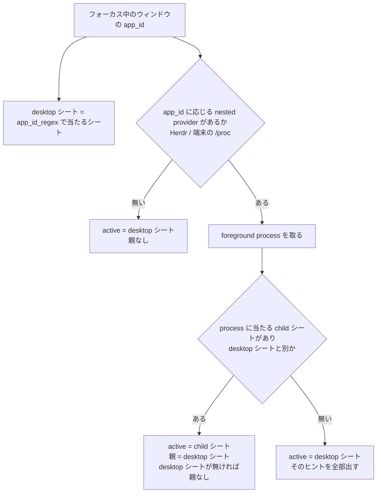
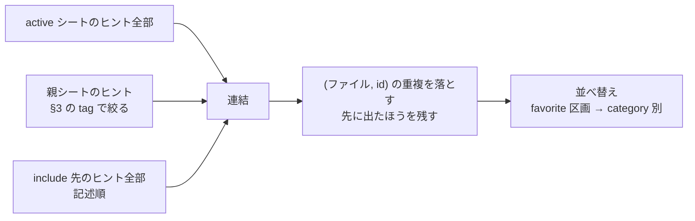
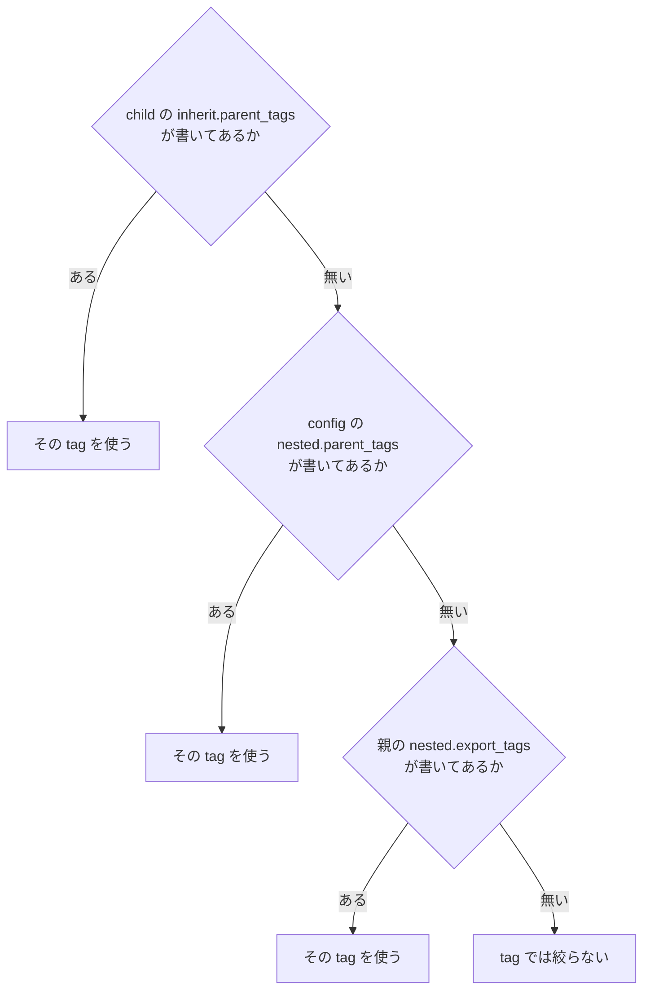
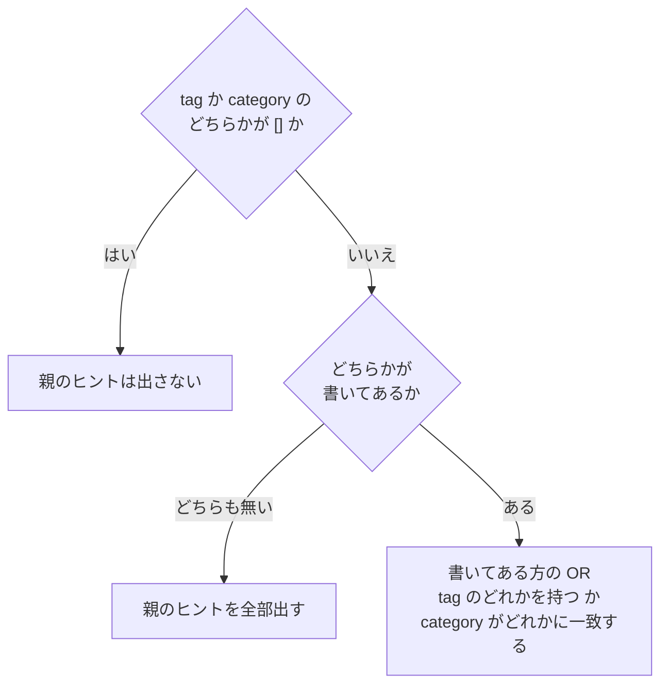
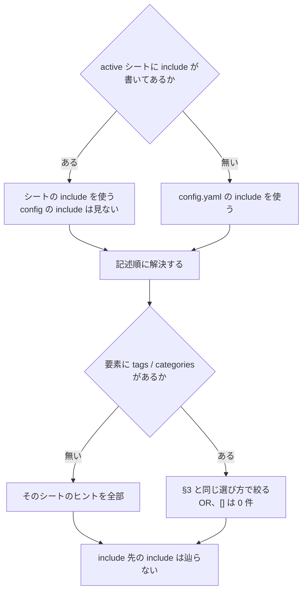

# SHEETS — シートの選ばれ方と、他シートのヒントの混ざり方

ヒント画面の一覧は 1 枚のシートだけでできているとは限らない。親シート(nested)と `include` の
2 経路で他のシートのヒントが混ざる。この文書はその規則を 1 か所にまとめる。YAML の各キーの形は
`dev-docs/DESIGN.md`「Data model」、決めた経緯は `dev-docs/DECISIONS.md` の各 entry が正。

用語:

- **desktop シート**: フォーカス中のウィンドウの app_id に `match.wayland.app_id_regex` が当たったシート。
- **child シート**: 端末や Herdr の中の foreground process に `match.process.*` が当たったシート。
- **active シート**: その context で主役になるシート。child があれば child、無ければ desktop。
- **親シート**: child が選ばれたときの desktop シート。

## 1. active シートと親シートの決まり方



- 複数のシートが当たったら priority → specificity(一致した regex の数)→ ファイル名順で 1 枚に
  決める(DECISIONS 0007)。
- nested provider を呼ぶかどうかは **app_id だけ**で決める。desktop シートの有無は関係ない
  (DECISIONS 0027)。そのため foot のように端末自身のシートが無くても、中の `vi` のシートは選ばれる。
  ただしこの場合は親が無いので、親ヒントは混ざらない。
- nested は 1 段だけ(`foot → tmux → herdr → claude` のような多段は辿らない。0027)。
- `match` の無いシートは active にならない。`include` から読み込まれたときだけ一覧に出る。

## 2. 一覧の組み立て



1. **連結**: active → 親(絞った分)→ include(記述順)の順につなぐ。
2. **重複の除去**: 同じヒントが 2 つの経路から来たら `(ファイル, id)` で 1 件にする(0019)。
   同じシートが親でもあり include 先でもある場合も、ここで 1 回にまとまる。
3. **並べ替え**(0014 D7):
   - favorite 区画: category を無視し、連結した順(= YAML の記述順)。
   - 非 favorite 区画: 非 favorite のヒントだけで数えた category の初出順。同じ category の中は記述順。
     `category: null` は 1 グループとして初出の位置に入る。
   - category の順番を決める設定は無い。変えるときは YAML の中でヒントの順番を入れ替える。

どこから来たヒントかは一覧に出さない(無印。0026)。詳細欄には所属ファイル名が出る。

## 3. 親ヒントの絞り(nested)

child が選ばれ、親シートがあるときだけ働く(0034、0039)。絞りは**タグ**と **category** の 2 本で、
それぞれ同じ規則で「どこに書いてあるものを使うか」を決める。



category も同じ形で、`inherit.parent_categories` → `nested.parent_categories` → `nested.export_categories`
の順に見る。tag と category は別々に決まる(tag は子、category は親から、ということもある)。

- **最初に書いてある段だけ**を使い、それより下の段は見ない。複数の段の積集合は取らない。
- 「書いてある」はキーがあること。`null` は書いていないのと同じ。

決まった tag と category で、親のヒントを次のように選ぶ。



- tag と category を両方書いたときは **OR**。どちらかに当たるヒントを出す。
- `[]` は、もう片方に何が書いてあっても **0 件**。`config.yaml` の `nested.parent_tags: []` で、どの親の
  ヒントも子に混ぜないようにできる(親に `export_categories` があっても破れない)。
- category は完全一致。category を書いていないヒントは、どの category 指定にも当たらない。

各段の役目(tag・category 共通):

| 段 | 書く場所 | 用途 |
|---|---|---|
| 1 | 子シートの `inherit.parent_tags` / `parent_categories` | この子だけ例外にする(全体で止めていてもこの子には渡す、など) |
| 2 | config.yaml の `nested.parent_tags` / `parent_categories` | **全体の opt-out(`[]`)用**。どの親のヒントも子に混ぜない |
| 3 | 親シートの `nested.export_tags` / `export_categories` | **通常はここで絞る**。何を子に渡すかを親自身が決める |
| 4 | (どこにも書かない) | 絞らない |

段 2 で絞る(空でない list を書く)ことは推奨しない。段 2 は段 3 より上にあるので、書いた時点で
全部の親の `export_*` が無視され、「Herdr だけ別の絞り」ができなくなる。段 2 が段 3 より上にある
のは、`[]` で全体を確実に止めるためである。

`export_*` は nested の親経路にだけ効く。同じシートが `include` で混ざるときは見ない(§4)。

```yaml
# hints/ja/herdr.yaml(親、抜粋)— pane タグか「基本」category のヒントだけを子に渡す
nested:
  export_tags: [pane]
  export_categories: [基本]
```

## 4. include

シートの `include:` に並べたシートのヒントを、そのシートの一覧に混ぜる(0026、0039)。要素は
シートの id(全部混ぜる)か、`{sheet, tags, categories}`(一部だけ混ぜる)。



```yaml
include:
  - wm                                   # 全部
  - {sheet: git, categories: [基本]}      # 「基本」category だけ
  - sheet: shell
    tags: [daily]                        # daily タグか「移動」category のヒント
    categories: [移動]
```

- シート側の `include` は config の既定を**置き換える**(足し算ではない)。
- 絞り込みは要素ごと。同じシートを 2 回、別の絞りで書いてもよい(重なったヒントは §2 で 1 件になる)。
- 解決できない id と、シートが自分自身を指す id は warning で、その id だけ無視する(シートは表示される)。
  config の既定は全シートに掛かるので、既定由来の自己参照は黙って外す。
- active シートが無い context では include も混ざらない(config の既定も)。

## 5. 経路の比較

| | 親シート(nested) | include |
|---|---|---|
| 何で決まるか | ウィンドウの app_id(desktop シート) | active シートの `include`、無ければ config |
| 絞り | §3 の 4 段で決まる tag / category | 要素ごとの `tags` / `categories` |
| 一覧の位置 | active の次 | 最後 |
| 多段 | しない(1 段) | しない(include 先の include は辿らない) |
| quick add の `Ctrl+P` | 追加先を親に切り替えられる | 無い |

## 6. 混ざったヒントを編集するとき

- 編集・削除・favorite は、そのヒントの**所属ファイル**に書く(0019、0014 D9)。
  親や include 先のヒントを直すと、そのシートのファイルが書き換わる。
- `J` / `K` の並べ替えはファイルを跨がない(0014 D8)。隣が別シートのヒントなら動かない。
- quick add の追加先は**選択中のヒントのシート**。未選択なら active シート(0025)。`Ctrl+P` で親
  シートに切り替えると、§3 で tag の絞りが決まっている場合に限り、その tag を自動で付ける
  (category の絞りに合わせた値は付けない。合わない category で足すと子の一覧には出ない。0034、0039)。
